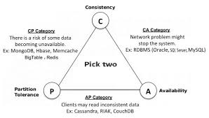

## Contributions:
*John Mashey* first used and popularized the word big data to describe challenges of handling massive datasets 

*Doug Laney* introduced 3 Vs (Volume, Velocity and Variety)

---
## Vs of Big Data

**Volume**: refers to the vast amounts of data generated every second.

**Velocity**: speed at which data is generated and processed.

**Variety**: different types of data (structured, unstructured, semi-structured).      

**Veracity**: Trustworthiness and analysis of data is very important in big data analytics.

**Value**: extracting meaningful insights from data.

**Visualization**: representing data in graphical format for better understanding.

**Validity**: ensuring data is accurate and reliable.

**Volatility**: data's relevance and lifespan over time. (retention period)

**Viscosity**: the complexity and difficulty in managing and processing data.

**Vulnerability**: security and privacy concerns associated with big data.

**Virality**: the speed and extent to which data spreads.

**Variability**: inconsistency of data flows, affecting data processing and analysis. (Such as shift in social media trends or seasonal sales) (Characteristic that explains the spikes in data)

---

## Types of Data Analytics 

1. **Descriptive analytics** tells what has happened in the past.
2. **Diagnostic analytics** helps to understand why something happened.
3. **Predictive analytics** forecasts what is likely to happen in the future.
4. **Prescriptive analytics** suggests actions to take for desired outcomes.

---
## Top Challenges facing Big Data
**Scale**: Verticallly or horizontally to take care of massive storage requirements.

**Security**: lack of proper authentication and authorization mechanisms.

**Schema**: need of dynamic schema for variety of data, rigid schema cannot work here.

**Continuous availability**: systems should be designed to be fault tolerant and highly available.

**Data quality**: ensuring accuracy, consistency, and reliability of data. - composition, condition and context, metadata needs to be maintained.

**Consistency**: maintaining uniformity and coherence of data across different sources and systems.

**Partition tolerance**: ability of a distributed system to continue functioning despite network partitions or failures. (takes care of hardware and software failures)

---

## Technology neeeded to meet these challenges:

---
## Introduction

**Atomicity**: ensures that a series of database operations either all occur successfully or none occur at all.

**Consistency**: ensures that a database remains in a valid state before and after a transaction.

**Isolation**: ensures that concurrent transactions do not interfere with each other.

**Durability**: ensures that once a transaction is committed, it remains so, even in the event of a system failure.

## CAP Theorem
In a distributed data store, it is impossible to simultaneously provide more than two out of the following three guarantees:
1. **Consistency**: Every read receives the most recent write or an error.
2. **Availability**: Every request receives a (non-error) response, without guarantee that
3. **Partition tolerance**: The system continues to operate despite an arbitrary number of messages being dropped (or delayed) by the network between nodes.

**C-P systems**: prioritize consistency and partition tolerance over availability. (e.g., traditional relational databases) (MongoDB, HbBase, MemCache BigTable, Redis)

**A-P systems**: prioritize availability and partition tolerance over consistency. (e.g., NoSQL databases like Cassandra, DynamoDB) (Cassandra, RIAK, CouchDB)

**C-A systems(not mentioned in class)**: prioritize consistency and availability over partition tolerance. (e.g., single-node databases)  Examples: (Oracle, SQL Server, MySQL)

## Extra 

**Data Lake**: A centralized repository that allows you to store all your structured and unstructured data at any scale.

**Data Mart**: A subset of a data warehouse that is focused on a specific business area or department. 

**Data Warehouse**: A large store of data accumulated from a wide range of sources within a company and used to guide management decisions.

hi |Traditional Business Intelligence (BI)| Big Data Analytics|
---|---|---|
Volume| GB to TB | PB to EB |
Organization of data | Structured data(Centralised server) | Structured, semi-structured, unstructured data(Distributed file systems) |
Model | Schema | no Schema |
Processing | Batch processing | Batch and Real-time processing |

learn one example for all

- the "2 or 3" formulation was always misleadinf because it tended to oversimplify the tension among properties
- CAP prohibits only a tiny part of the design spcace

BASE 
- Basically Available: if a node fails or the part of data is not available, the data layer is still operational and available
- Soft state: the state of the system may change over time, even without input.
- Eventual consistency: the system will become consistent over time, given that the system doesn't receive input during that time

## NoSQL Databases (Not only SQL)
- Non relational database management systems
- developed to rise in the violume of data stored about user, objects and their interactions on the internet
- Instrad of usinf structured tables, NoSQL databases use a variety of data models including document, graph, key-value, and wide-column stores.
- before no sql databases, relational databases and analytical (olap) were used to store and manage data
- after no sql, relational, analytical (olap), key-value, column-family, graph, document. 

|SQL|NoSQL|
|---|---|
|Relational databases|Non-relational databases|
|Fixed schema|Dynamic schema|
|Vertical scaling|Horizontal scaling|
|ACID transactions|Brewer's CAP theorem|
|Uses SQL| Uses UnQL|
|Not preferred for large volumes of unstructured data|Preferred for large volumes of unstructured and semi-structured data|
|Not best for heirarchical data storage|Best for hierarchical data storage|
|Excellent support from vendors|Relies heavily on community support|

## Advantages of NoSQL Databases
- cheap, easy to implement
- flexible schema
- easy to distribute

Distributed Computting
Advantages:
- Reliability

## NewSQL Databases
- SQL interface for application interaction
- ACID support for transactions
- An architecture that provides high performance vis-a-vis traditional RDBMS solution
- Scale out, shared nothing architecture
- Non-locking concurrency control mechanismsso that real time reads will not conflict with writes