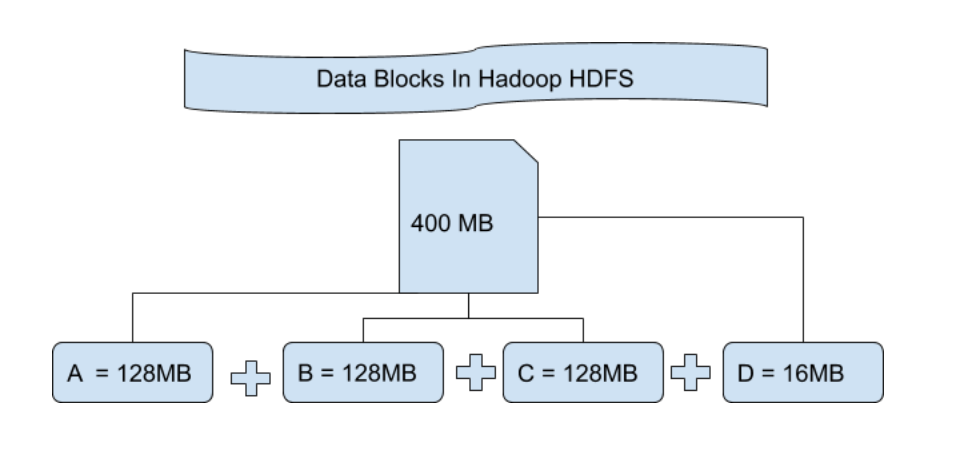

# Hadoop

Hadoop is an open-source framework that allows for the distributed processing of large data sets across clusters of computers using simple programming models. It is designed to scale up from a single server to thousands of machines, each offering local computation and storage.

Hadoop Core components:
1. Hadoop Distributed File System (HDFS): A distributed file system that provides high-throughput access to application data. It splits large files into smaller blocks and distributes them across the cluster. Handles and stores large data. Scales a single hadoop cluster to thousands of nodes. Storage layer. Splits the files into blocks (default 64MB or 128MB), creates copies and distributes them across the cluster. 

Each block is replicated across multiple nodes (default 3 replicas) to ensure fault tolerance and high availability. Provides access to streaming data (constant bitrate when transferring data rather tha having the data transferred in waves). 

    Rack awareness: HDFS is aware of the rack topology of the cluster, which helps in optimizing data placement and replication for better fault tolerance and network bandwidth utilization.
    Rack is a collection of about 40 to 50 data nodes usign the network switch

        - Chossing data node racks that are closets to each other
        - improves cluster performance by reducing network traffic between racks
        - name node keeps track of the rack ID information
        - Replication can be done through rack awareness 
        
2. MapReduce: A programming model for processing large data sets with a parallel, distributed algorithm on a cluster. Fisrt method used to query data stored in HDFS. It consists of two main functions: Map (which processes input data and produces intermediate key-value pairs) and Reduce (which aggregates the intermediate data to produce the final output).

3. YARN (Yet Another Resource Negotiator): A resource management layer that manages and schedules resources across the cluster, allowing multiple data processing engines to run on Hadoop. Prepares Hadoop for bath, stream, interactive and graph processing.

### 