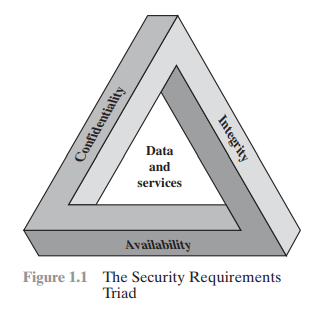

# Chapter 1

#### Key Points:
- The Open Systems Interconnection (OSI) security architecture provides
a systematic framework for defining security attacks, mechanisms, and
services.
- Security attacks are classified as either passive attacks, which include
unauthorized reading of a message of file and traffic analysis or active
attacks, such as modification of messages or files, and denial of service.
- A security mechanism is any process (or a device incorporating such a
process) that is designed to detect, prevent, or recover from a security attack.
Examples of mechanisms are encryption algorithms, digital signatures, and
authentication protocols.
- Security services include authentication, access control, data confidentiality,
data integrity, nonrepudiation, and availability.

### 4 main areas if cryptographic algorithms & protocols
-  Symmetric encryption: Used to conceal the contents of blocks or streams of
data of any size, including messages, files, encryption keys, and passwords.
- Asymmetric encryption: Used to conceal small blocks of data, such as encryption
keys and hash function values, which are used in digital signatures.
- Data integrity algorithms: Used to protect blocks of data, such as messages,
from alteration.
- Authentication protocols: These are schemes based on the use of cryptographic
algorithms designed to authenticate the identity of entities.

## Computer Security Concepts
The protection afforded to an automated information system in order to attain the
applicable objectives of preserving the integrity, availability, and confidentiality of
information system resources (includes hardware, software, firmware, information/
data, and telecommunications).

### CIA Triad
-  Confidentiality: 
    - preservation of authorized restrictions on information access and disclosure, including means for protecting personal privacy and proprietary information.
    - loss of confidentiality is the unauthorized disclosure of information.
    - This term covers two related concepts:
        - Data confidentiality: Assures that private or confidential information is not made available or disclosed to unauthorized individuals.
        - Privacy: Assures that individuals control or influence what information related to them may be collected and stored and by whom and to whom that information may be disclosed.
    - Examples:
        - High: Student grade information must be accessible only to authorized students, parents, and staff; unauthorized disclosure can cause serious privacy and legal issues (FERPA).

        - Moderate/Low: Enrollment or directory information is seen by many people and often publicly available, so disclosure causes little or no damage.

- Integrity: 
    - guarding against improper information modification or destruction, and includes ensuring information nonrepudiation and authenticity.
    - loss of integrity is the unauthorized modification or destruction of information.
    - This term covers two related concepts:
        - Data integrity: Assures that information and programs are changed only in a specified and authorized manner.
        - System integrity: Assures that a system performs its intended function in an unimpaired manner, free from deliberate or inadvertent unauthorized manipulation of the system.
    - Examples:
        - High: Hospital patient allergy data must be accurate and up to date; any falsification can cause serious harm or death and legal liability.

        - Moderate/Low: Online forums or anonymous polls can tolerate incorrect or altered data since inaccuracies cause minimal damage.

- Availability: 
    - Ensures timely and reliable access to and use of information.
    - loss of availability is the disruption of access to or use of information or an information system.
    - Examples:
        - High: Authentication services for critical systems must be continuously available, as downtime causes major productivity and financial losses.

        - Moderate/Low: University websites or online directories can tolerate short outages since alternatives exist and impact is mostly inconvenience.

2 additional concepts:

- Authenticity:
    - the propery of being genuine and being able to be verified and trusted.
    - confidence in the validity of a transmission, a message, or an originator.
    - verifying that users are who they say they are and that each input arriving at the system came from a trusted source.
- Accountability:
    - generates the requirement for actioons of an entity to be traced uniquely to that entity.
    - supports nonrepudiation, deterrence, fault isolation, intrusion detection and prevention, and after-action recovery and legal action.
    - must be able to trace a security breach to a responsible party.
    - systems must keep records of security-relevant events in an audit log.

### The Challenges of Computer Security
1. Reasoning required for security (not as simple as it seems)
2. Must always consider potential attacks on the security 
3. Security mechanisms might be complex and counterintuitive (due to point 2)
4. Need to decide where to place the trust (hardware, software, people)
5. 