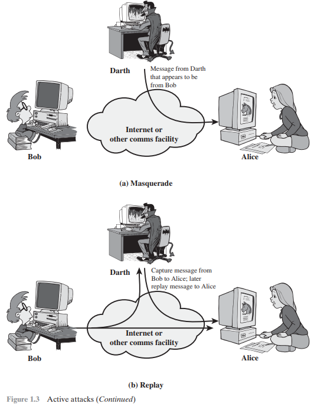
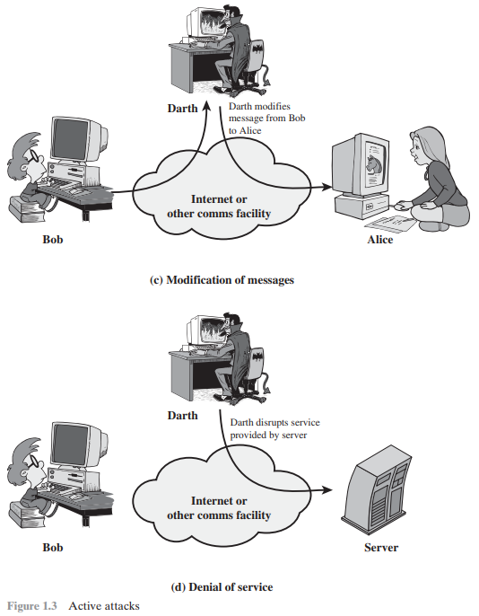

# Chapter 1

### 3 types of security
- **Computer security**: collection of tools designed to protect data & prevent unauthorized access from hackers.
- **Network security**: protects data during transmission across systems without use of the internet.
- **Internet security**: protects data during transmission over an interconnected network.

### 4 main areas if cryptographic algorithms & protocols (skip)
-  Symmetric encryption: Used to conceal the contents of blocks or streams of
data of any size, including messages, files, encryption keys, and passwords.
- Asymmetric encryption: Used to conceal small blocks of data, such as encryption
keys and hash function values, which are used in digital signatures.
- Data integrity algorithms: Used to protect blocks of data, such as messages,
from alteration.
- Authentication protocols: These are schemes based on the use of cryptographic
algorithms designed to authenticate the identity of entities.

## Computer Security Concepts
The protection afforded to an automated information system in order to attain the applicable objectives of *preserving the integrity, availability, and confidentiality* of information system resources.

### CIA Triad

-  **Confidentiality**:  preservation of authorized restrictions on information access and disclosure
    - for protecting personal privacy and proprietary information.
    - loss of confidentiality is the unauthorized disclosure of information.
    - This term covers two related concepts:
        - **Data confidentiality**: Assures that confidential information is not made available  to unauthorized individuals.
        - **Privacy**: Assures that individuals control what information related to them may be collected and stored and by whom and to whom that information may be disclosed.
    - Examples:
        - High: Student grade information must be accessible only to authorized students, parents, and staff; unauthorized disclosure can cause serious privacy and legal issues (Digilocker).
        - Moderate/Low: Enrollment or directory information is seen by many people and often publicly available, so disclosure causes little or no damage.

- **Integrity**: guarding against improper information modification or destruction
    - Ensuring information nonrepudiation and authenticity.
    - loss of integrity is the unauthorized modification or destruction of information.
    - This term covers two related concepts:
        - **Data integrity**: Assures that information and programs are changed only in a specified and authorized manner.
        - **System integrity**: Assures that a system performs its intended function in an unimpaired manner, free from (deliberate or inadvertent) unauthorized manipulation of the system.
    - Examples:
        - High: Hospital patient allergy data must be accurate and up to date; any falsification can cause serious harm or death and legal liability.
        - Moderate/Low: Online forums or anonymous polls can tolerate incorrect or altered data since inaccuracies cause minimal damage.

- **Availability**: Ensures that systems work timely and service is not denied to authorized users.
    - loss of availability is the disruption of access to or use of information or an information system.
    - Examples:
        - High: Authentication services for critical systems must be continuously available, as downtime causes major productivity and financial losses.
        - Moderate/Low: University websites or online directories can tolerate short outages since alternatives exist and impact is mostly inconvenience.

##### 2 additional concepts: (skip)
- Authenticity:
    - the propery of being genuine and being able to be verified and trusted.
    - confidence in the validity of a transmission, a message, or an originator.
    - verifying that users are who they say they are and that each input arriving at the system came from a trusted source.
- Accountability:
    - generates the requirement for actioons of an entity to be traced uniquely to that entity.
    - supports nonrepudiation, deterrence, fault isolation, intrusion detection and prevention, and after-action recovery and legal action.
    - must be able to trace a security breach to a responsible party.
    - systems must keep records of security-relevant events in an audit log.

### The Challenges of Computer Security (skip)
1. Reasoning required for security (not as simple as it seems)
2. Must always consider potential attacks on the security 
3. Security mechanisms might be complex and counterintuitive (due to point 2)
4. Need to decide where to place the trust (hardware, software, people)
5. Need to manage secret information (keys, credentials) and secure distribution
6. Battle between attackers and defenders
7. Security is undervalued until failure occurs
8. Continuous monitoring is required
9. Security is often added on after system design
10. Strong security is frequently seen as reducing usability and system efficiency.

## The OSI Security Architecture 
The OSI system architecture is useful to managers as a way of organising the task to provide security. It focuses on security attacks, security mechanisms, and security services.

### Threat
Threat is a possible danger that might exploit a vulnerability.

### Attack
An assault on system security that performed by an intelligent threat; an intelligent act that is a deliberate attempt to retrieve or manipulate data or to compromise system integrity.

### OSI Security Architecture
- Security attack: any action that compromises the security of information owned by an organization. 
- Security mechanism: A process designed to detect, prevent, or recover from a security attack.
-  Security service: A service that enhances the security of the data processing systems and the information  transfers of an organization. The services are intended to counter security attacks, and they use of one or more security mechanisms to provide the service.

## Security Attacks
Any action that compromises the security of information owned by an organization. Attacks can be passive or active as per X.800 and RFC 2828.

### Passive Attacks
- an attacker observes the messages and uses them for malicious purposes without affecting the system resources.
- Involve eavesdropping or monitoring transmissions
- Goal is to obtain transmitted information
- Do not alter data

- Types: release of message contents and traffic analysis (skip)
    - Release of contents exposes confidential data (calls, emails, files)
    - Traffic analysis studies communication patterns (hosts, frequency, length)
- Can reveal nature of communication even if encrypted
- Very difficult to detect
- Focus is on prevention, mainly using encryption

### Active Attacks
- an attacker tries to modify the content of the messages or to create false messages.
- Involve modification or fabrication of data
- Hard to prevent completely due to many vulnerabilities

- Easier to detect than passive attacks
- Goal is detection and recovery (deterrence helps prevention)
- Types of Active Attacks
    - Masquerade: one entity pretends to be another
    - Replay: captured data is retransmitted later
    - Modification: messages altered, delayed, or reordered
    - Denial of Service: blocks or degrades communication services

## Security Services
A service that enhances the security of the data processing systems and the information transfers of an organization. The services are intended to counter security attacks, and they use of one or more security mechanisms to provide the service. 

- X.800: A security service is provided by a protocol layer to ensure secure systems or data transfer.
- RFC 2828: A security service is a processing/communication service that protects system resources.
- Security services implement security policies and are implemented using security mechanisms.

X.800 defines **5 categories**: (and 14 specific security services)
1. Authentication
2. Access Control
3. Data Confidentiality
4. Data Integrity
5. Nonrepudiation

### Authentication
- assurance that the identity of communicating entities is as claimed.
- Ensures messages and connections are genuine
- Prevents masquerade and unauthorized replay
- Types: (skip)
    - Peer Entity Authentication: 
        - Verifies identity during connection setup or data transfer
        - Protects against masquerade and replay attacks
    - Data-Origin Authentication
        - Verifies the source of a data unit
        - Does not protect against modification or duplication
        - Used in applications like email

### Access Control
- Prevents unauthorized use of system resources
- Controls who can access, when, and what actions are allowed
- Requires prior authentication of entities

### Data Confidentiality
- Protects data from unauthorized disclosure (passive attacks).
- Types: (skip)
    - Connection Confidentiality – protects all data on a connection
    - Connectionless Confidentiality – protects a single data block
    - Selective-Field Confidentiality – protects specific fields
    - Traffic-Flow Confidentiality – hides traffic patterns (source, destination, frequency, length)

### Data Integrity
- Ensures data is received exactly as sent.
- Protects against modification, insertion, deletion, replay, and destruction
- Applies to streams, single messages, or selected fields
- Types: (skip)
    - Connection Integrity (with recovery) – detects and recovers from errors
    - Connection Integrity (without recovery) – detection only
    - Selective-Field Connection Integrity – protects specific fields
    - Connectionless Integrity – protects individual messages
    - Selective-Field Connectionless Integrity – protects fields in one message
- Focus is on detection, with optional automated recovery

### Nonrepudiation
- Prevents denial of participation in communication.
    - Nonrepudiation of Origin – proof sender sent the message (skip)
    - Nonrepudiation of Destination – proof receiver received the message (skip)

### Availability Service
- Ensures systems and resources are accessible on demand
- Protects against denial-of-service attacks
- Depends on access control and proper resource management
- Some attacks need automated defenses; others require physical or administrative action

