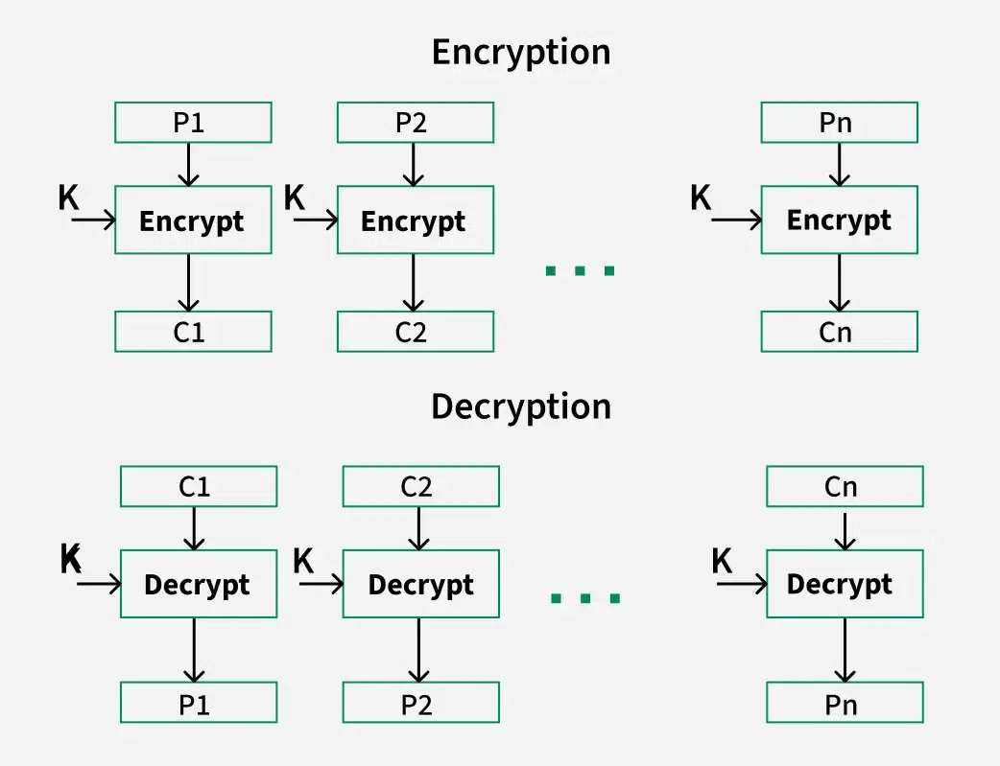

# Classical cryptography techiniques

### Basic Terminologies:
- **Plaintext**: The original message that needs to be encrypted.
- **Ciphertext**: The encrypted message that results from the encryption of the plaintext. 
- **Cipher**: refers to the algorithm used for encryption and decryption.
- **Key**: A piece of information used in conjunction with the cipher to encrypt and decrypt messages.
- **Encryption or Encipher**: The process of converting plaintext into ciphertext using an algorithm and a key.
- **Decryption or decipher**: The process of converting ciphertext back into plaintext using an algorithm and a key.
- **Cryptography**: The study and practice of techniques for encrypting and decrypting information to ensure its confidentiality, integrity, and authenticity.
- **Cryptanalysis**: The study and practice of analyzing and breaking cryptographic systems to uncover hidden information without knowledge of the key. (Method of deciphering without the knowing the key. Brute force attack)
- **Cryptology**: The study of both cryptography and cryptanalysis.


### Types of Cryptography Techniques:
#### A. Types based on Operation:
1. Substitution: replacing elements of the plaintext with other elements.
2. Transposition: rearranging the elements of the plaintext.
3. Product: combining substitution and transposition techniques.

#### B. Types based on Number of Keys:
1. Single key (Pritvate/Symmetric Key): uses the same key for both encryption and decryption.
2. Two keys (Public/Asymmetric Key): uses a pair of keys - a public key for encryption and a private key for decryption.

#### C. Types based on the Size of Plaintext:
1. Block: (Fixed size chunks) processes the plaintext in fixed-size blocks. Size defined by the user?
2. Stream

### Symmetric Key Encryption:
- Processing input in two ways:
  1. Block Cipher: processes fixed-size blocks of plaintext.
    - Types of Block Ciphers:
        - Transpositon Cipher: rearranges the positions of characters in the plaintext.
        - Substitution Cipher: replaces each character in the plaintext with another character.
            - Polyalphabetic substitution: uses multiple substitution alphabets to enhance security.
            - Monoalphabetic substitution: uses a single substitution alphabet for the entire message.
            - Polygram substitution: replaces groups of characters with other groups of characters.
            - Homophonic substitution: uses multiple ciphertext symbols for a single plaintext symbol to obscure frequency analysis.
  2. Stream Cipher: processes plaintext one bit or byte at a time, often used for real-time data.

### Asymmetric Key Encryption:
1. RSA Public Key: based on the mathematical properties of large prime numbers.
2. Elliptic Curve Cryptography (ECC): based on the algebraic structure of elliptic curves over finite fields.
3. Diffie-Hellman Key Exchange: a method for securely exchanging cryptographic keys over a public channel.

### Block Cipher:
- It transforms a fixed length block of plaintext data into a block of ciphertext data of the same length with the help of a secret key.
        
- The fixed length is called as block size. Many block ciphers prefer block sizes of 64 bits for example AES, DES, 3DES, Blowfish etc.
   

### Substitution Cipher Example:
- Under a substitution cipher, unit maybe a single letter or pairs of letters or triplets of letters and so on, which are substituted with cipher text for a plaintext. 
- Monoalphabetic substitution cipher is a type of substitution cipher where each letter in the plaintext is replaced with a corresponding letter in the ciphertext alphabet.
    - For example, using the following substitution alphabet:
        Plaintext: COLLEGE (K = 1)
        Ciphertext: DPMMHJF
- Polyalphabetic substitution cipher uses multiple substitution alphabets to enhance security.
    - For example, using two different substitution alphabets:
        Plaintext: COLLEGE
        Ciphertext: DQMMHJF (using first alphabet)
        Ciphertext: EPNNIGK (using second alphabet)
- Polygram substitution cipher replaces groups of characters with other groups of characters using a predefined substitution table.
    - For example, using bigrams (pairs of letters):
        Plaintext: CO LL EG E
        Ciphertext: XY AB CD EF (using a predefined bigram substitution table)
- Homophonic substitution cipher uses multiple ciphertext symbols for a single plaintext symbol to obscure frequency analysis.
    - For example, the letter 'E' in plaintext could be represented by multiple symbols in ciphertext, such as 'X', 'Y', or 'Z', based on a predefined mapping.
    Plaintext: E
    Ciphertext: XXXXXXXX

## Monoalphabetic Substitution:
- C = l(m) = m + k mod s
    - C = Ciphertext letter
    - l = Encryption function
    - m = Plaintext letter
    - k = Key (shift value)
    - s = Size of the alphabet (e.g., 26 for English alphabet)
- The most common monoalphabetic substitution cipher is the Caesar cipher, which shifts each letter in the plaintext by a fixed number of positions down the alphabet.
    - For example, with a shift of 3:
        - Plaintext: A B C D E F G H I J K L M N O P Q R S T U V W X Y Z
        - Ciphertext: D E F G H I J K L M N O P Q R S T U V W X Y Z A B C

#### Classical Substitution Cipher:
- Letters of plaintext is replaced by letters, numbers or symbols.
- Caesar Cipher is a popular example of classical substitution cipher.
- Julius Caesar used this cipher to communicate with his generals.
- In this cipher, each letter in the plaintext has an index. For example, A=0, B=1, C=2, ..., Z=25.
- C = E(P) = P + k mod 26 and P = D(C) = C - k mod 26
    - C = Ciphertext letter
    - E = Encryption function
    - P = Plaintext letter
    - k = Key (shift value)
    - 26 = Size of the alphabet
- Questions: 
    - Encrypt the plaintext "CAT" with shift value 3.
        - Plaintext: C A T
        C: 2 + 3 = 5 mod 26 -> F (26|5)
        A: 0 + 3 = 3 mod 26 -> D
        T: 19 + 3 = 22 mod 26 -> W
        - Ciphertext: F D W
    - Encrypt the plaintext "XYZ" with shift value 3.
        - Plaintext: X Y Z
        X: 23 + 3 = 26 mod 26 -> 0 -> A
        Y: 24 + 3 = 27 mod 26 -> 1 -> B
        Z: 25 + 3 = 28 mod 26 -> 2 -> C
        - Ciphertext: A B C
    - Decrypt the ciphertext "KHOOR" with shift value 3.
        - Ciphertext: K H O O R
        - Plaintext: H E L L O
    - Decrypt the ciphertext "CDE" with shift value 3.
        - Ciphertext: C D E
        C: 2 - 3 = -1 mod 26 -> 25 -> Z
        D: 3 - 3 = 0 mod 26 -> A
        E: 4 - 3 = 1 mod 26 -> B
        - Plaintext: Z A B
    - Decrypt the ciphertext "ABC" with shift value 3.
        - Ciphertext: A B C
        - Plaintext: X Y Z
    - Decrypt the ciphertext "WKLV" without shift value. (Cryptanalysis example)
        - Ciphertext: W K L V
        Shift value 1: V J K U
        Shift value 2: U I J T
        Shift value 3: T H I S
        - Plaintext: THIS (with shift value 3)
    - What is shift value for the ciphertext "WHVW". (Cryptanalysis example)
        - Ciphertext: W H V W
            - Shift value 1: V G U V
            - Shift value 2: U F T U
            - Shift value 3: T E S T
        - Shift value is 3 for plaintext "TEST"
    - What is shift value for the ciphertext "GCUA VQ DTGCM". (Cryptanalysis example)
        - Ciphertext: GCUA VQ DTGCM
            - Shift value 1: FBTZ UP CSFBL
            - Shift value 2: EASY TO BREAK
        - Shift value is 2 for plaintext "EASY TO BREAK"

### Cryptanalysis of Caesar CIpher
- only 26 possibble ciphers
- could simply try each in turn
- brute force attack or exhaustive search
- given ciphertext, just try to shift all letters
- more secure than simple substitution cipher


### Mono Alphabetic Substitution Cipher
- Rather than just shifting the alphabets, it shuffles the letters randomly.
- each plaintext letter maps to a different random ciphertext letter.
- number of possible keys = 26! = 4 x 10^26 -> more secure than caesar cipher

Language Redundancy and Cryptanalysis
- human languages have redundancy
- example: "th lrd s m shphrd shll nt wnt" -> "the lord is my shepherd shall not want"
- letters are not equally commonly used
- in english, e is most common letter, followed by t, a, o, i, n, s, h, r
- other letters are fairly rare: z, q, x, j

|Frequency Analysis of English Language| Letters and Bigrams|
|---|---|
|Most Frequent Letters in English| E T A O I N S H R D L U|
|Most Frequent Bigrams| th he in er an re nd at on nt ha es st en of te ed is it al ar ti to|
|---|---|


Use in crypanalysis:
- mono alphabetic substitution ciphers do not change relative ketter frequencies
- calculate letter frequencies in ciphertext
- compare with known letter frequencies in language
- ...

### Substitution Cipher: Polygram
- it involes group of characters being substituted by another group of characters.
- the character group can be digram (2 letters), trigram (3 letters) or ngrams (n letters).
- For digram substitution, there are many possible keys for 26 characters:
    - number of possible digrams = 26 x 26 = 676
    - number of possible keys = 676! = 4.3 x 10^1551
- Playfair cipher is a popular example of polygram substitution cipher.
    - 5 x 5 matrix of letters for word CRYPTOGRAPHY
        ```
        C R Y P T
        O G A H B
        D E F I K
        L M N Q S
        U V W X Z
        ```