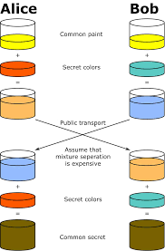
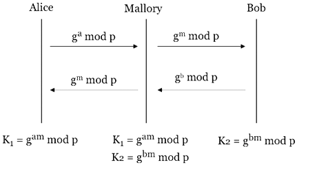
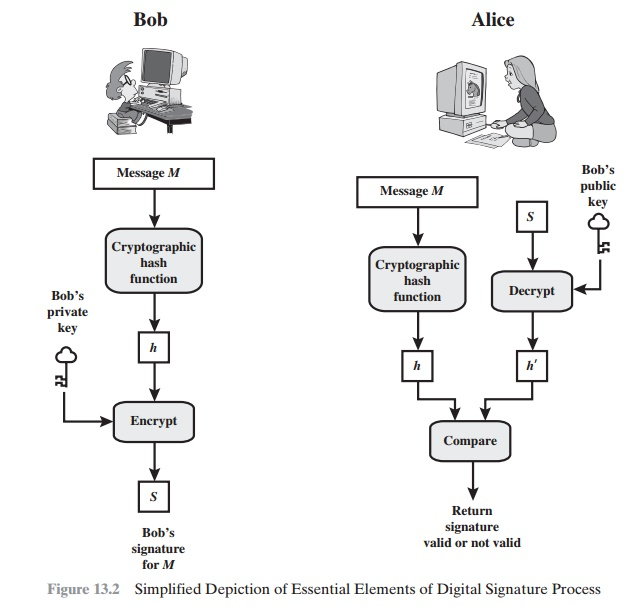
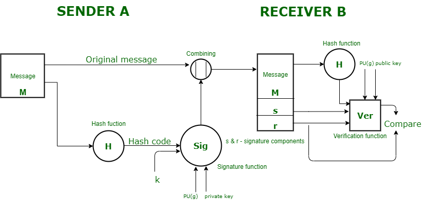
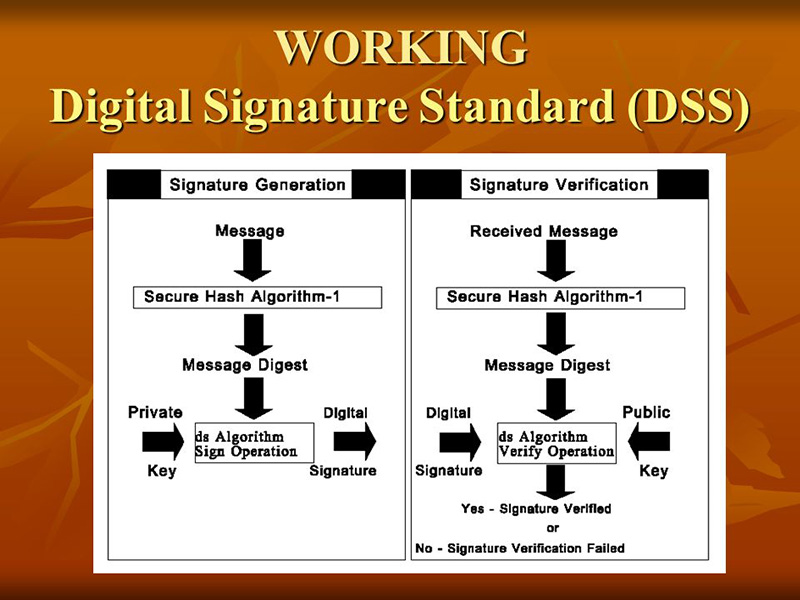

### Dicrete Logarithm
- g^x ≡ h (mod p) where g is the primitive element in Zp, x is dicrete logarithm of of h with base g mod p
- x = d log_(g*p) (h)

- example 
    - d loggp (1) = 0
        - g^0 ≡ 1 (mod p)
    - d loggp (g) = 1
        - g^1 ≡ g (mod p)

# ElGamal Encryption Algorithm
- ElGamal encryption algorithm is a public key cryptosystem
- it  is based on the difficulty of finding the discrete logarithm in a cyclic group (that is even if we know g^a and g^k, it is extremely difficult to compute g^ak.)
- it was proposed by Taher Elgamal in 1985.
- it is asymmetric encryption algorithm that uses a pair of keys: a public key for encryption and a private key for decryption.

## Key Generation
- Select a large prime as a q
- Select x to be a member of the group G = \<Zq*, X\> (G = [Zq*,X]), x must be "1 <= x <= q - 1"
- Select g to be a primitive root (generator) in the group G = <Zq*, X>, y = g^x mod q
- Public key: (g, y, q)
- Private key: x

## Encryption
- Select a random integer r in the group G = <Zq*, X>, r must be "1 <= r <= q - 1"
- Compute c1 = g^r mod q
- Compute c2 = (p * y^r) mod q where p is the plaintext message
- c1 carries the random exponent information required to compute the shared secret, and c2 carries the encrypted message.

## Decryption
- P = [c2 * (c1^x)^(-1)] mod q

### Examples
- Encrypt message m = 10 using public key 9 and primitive root as 11 and a prime number 23, also a random number r = 3
    - m = 10
    - g = 11
    - q = 23
    - y = 9
    - r = 3
        - c1 = g^r mod q = 11^3 mod 23 = 20
        - c2 = (m * y^r) mod q = (10 * 9^3) mod 23 = 22
- Decrypt the ciphertext (c1, c2) = (20, 22) using private key x = 6
    - P = [c2 * (c1^x)^(-1)] mod q
    - P = [22 * (20^6)^(-1)] mod 23
        - 20^6 mod 23 = 16
        - Using extended euclidean algorithm, we can find the multiplicative inverse of 16 mod 23, which is 13 (since 16 * 13 mod 23 = 1)
    - P = [22 * 13] mod 23 = 10

- Perform encryption and decryption using ElGamal encryption algorithm with the following parameters:
    - m = 20
    - g = 7
    - q = 23
    - r = 3
    - x = 9
    - y = g^x mod q = 7^9 mod 23 = 15
    - Encryption:
        - c1 = g^r mod q = 7^3 mod 23 = 21
        - c2 = (m * y^r) mod q = (20 * 15^3) mod 23 = 18
    - Decryption:
        - P = [c2 * (c1^x)^(-1)] mod q
        - 21^9 mod 23 = 17
        - Using extended euclidean algorithm, we can find the multiplicative inverse of 17 mod 23, which is 19 (since 17 * 19 mod 23 = 1)
        - P = [18 * 19] mod 23 = 20

# Diffie-Hellman Key Exchange Algorithm

- it is used for key exchange mechanism to verify if a right key is shared by the right person
- if a third party has identified the common secret, it would be still difficult to determine the private keys of the parties involved in the key exchange
- it is based on the difficulty of finding the discrete logarithm in a cyclic group (that is even if we know g^a and g^b, it is extremely difficult to compute g^(ab).)

- it uses two numbers: 
    - a prime number 
    - the primitive root of the prime number
- this algorithm is a means for two parties to jointly establish a shared secret over an unsecured chanel
    |Group Member|step|GCKS|
    |--|--|--|
    |p, g| Agree on prime and generator |p, g|
    |a| Generate a private key |b|
    |A = g^a mod p| Compute public key |B = g^b mod p|
    ||Exchange public keys||
    |K = B^a mod p => K = (g^b mod p)^a => K = g^(ab) mod p|Compute shared secret key|K = A^b mod p => K = (g^a mod p)^b => K = g^(ab) mod p|

- p = 13, g = 6, a = 5, b = 4
    - A = g^a mod p = 6^5 mod 13 = 2
    - B = g^b mod p = 6^4 mod 13 = 9
    - K = B^a mod p = 9^5 mod 13 = 3
    - K = A^b mod p = 2^4 mod 13 = 3
    - right person has the right key and the shared secret key is 3

# Man-in-the-Middle Attack

- can be performed on diffie hellman key exchange algorithm where the information sent and recieved can be manipulated
Alice -A = g^a mod p-> Mallory -Z = g^z mod p-> Bob
Bob -B = g^b mod p-> Mallory -Z = g^z mod p-> Alice
- Mallory can compute the shared secret key with both Alice and Bob, and can intercept and modify the messages sent between them without their knowledge

# Digital Signature
- a digital signature is an authentication mechanism that enables the creator of a message to attach a code that acts as a signature
- typically the signature is formed by taking the hash of the message and encrypting the message with the creator's private key
- the signature guarentees the source and integrity of the message

Bob:
```
                                    bobs private key
                                        |
                                        v
Message -> cryptographic hash -> k -> encrypt -> s -> Bobs singature for M
```


RSA approach of digitqal signature:



- Message authen protects two parties who exchange messages from any third party. however, it does not protect the two parties against each other.
- bob sends an authenticated message to alice
    - alice can forge a different message and claim that it came form Bob. (Alice simply needs to create a new message and append an auth code using the key thaat BOb and Alice share)
    - bob can deny sending the meesage. Because it is possuble for Alice to forge a message, Bob can claim that he never sent the message. (Bob can simply claim that Alice forged the message and signature)
- Digital signature properties:
    - must verify that the author and the date and time of the signature
    - it must authenticate the contents at the time of the signatures
    - it must be vrifiable by third parties, to resolve disputes

# Digital Signature Standard (DSS) or Digital Signature Algorithm (DSA)
- DSS defines algos that are used to generate digital signatures with the help of Secure Hask Algorithm (SHA) for the authentication of electronic documents
- it only digital signature algorithm, and does not specify any encryption algorithm, decryption algorithm, or key exchange algorithm

- K is the random no
- Signature is (s, r)
- G is the global parameter


Message digest -> hash value 

## Sender side
- In DSS approach, a hash code is generated out of the message and the following inputs are used to generate the signature function:    
    - In the sender side, a hash code is generated
    - the random number 'k' generated for that particular signature.
    - the provate key of the sender Pr(a)
    - the global public key (which is a set of parameters for communicating principles) PU(g)
- these input to the function will provide us with the output signature (s, r) (r should NOT be zero)
- the original message concstenated wiht the signatue is sent to the receiver

## Reciever side:
- At the reciever send, the verification of the sender is done. The hash code of the sent message is generated.
- there is a verification function which takes the follwoing inputs:
    - the hash code of the message generated at the reciever side
    - the signature (s, r) sent by the sender
    - the public key of the sender PU(a)
    - the global public key
- the output of the verification function is compared with the signature component r.
- both the values will match if the sent signature is valid because only the sender with the help of his provate key can generate a valid signature.

## DSA
- Private: x
- Public: p, q, g, y
    - p: 512 ~ 1024 bit prime 
    - q: 160 bit prime, q | (p-1)
    - g: generator of order q
    - x: 0 < x < q
    - y: g^x mod p
- Signing:
    - Pick a random k such that 0 < k < q
    - r = (g^k mod p) mod q and if r = 0, pick another k
    - s = k^(-1)(SHA1(m) + x * r) mod q
        - ((k^(-1) mod q) * (SHA1(m) + x * r) mod q) mod q and if s = 0, pick another k
- Verifying:
    - w = s^(-1) mod q
    - u1 = SHA1(m) * w mod q
    - u2 = r * w mod q
    - v = ((g^u1 * y^u2) mod p) mod q
    - if v == r, the signature is valid, otherwise it is invalid

### Example
- p = 283, q = 47, g = 60
- x = 24, h(m) = 41, k = 15

- r = (g^k mod p) mod q = (60^15 mod 283) mod 47 = 207 mod 47 = 19 != 0
- 60^15 mod 283:
    - 15 = (1111)2 = 2^3 + 2^2 + 2^1 + 2^0
    - 60^1 mod 283 = 60
    - 60^2 mod 283 = 60^1 * 60^1 mod 283 = 60 * 60 mod 283 = 204
    - 60^4 mod 283 = 60^2 * 60^2 mod 283 = 204 * 204 mod 283 = 15
    - 60^8 mod 283 = 60^4 * 60^4 mod 283 = 15 * 15 mod 283 = 225
    - 60^15 mod 283 = 60^8 * 60^4 * 60^2 * 60^1 mod 283 = 225 * 15 * 204 * 60 mod 283 = 207
- s = k^(-1)(h(m) + x * r) mod q
    - k^(-1) mod q = 15^(-1) mod 47 = 22
    - s = 22 * (41 + 24 * 19) mod 47 = 30
- Verification:
    - w = s^(-1) mod q = 30^(-1) mod 47 = 11
    - u1 = h(m) * w mod q = 41 * 11 mod 47 = 28
    - u2 = r * w mod q = 19 * 11 mod 47 = 21
    - y = g^x mod p = 60^24 mod 283 = 158
    - v = ((g^u1 * y^u2) mod p) mod q
        - g^u1 mod p = 60^28 mod 283 = 106
        - y^u2 mod p = 158^21 mod 283 = 42
        - v = ((106 * 42) mod 283) mod 47 = (4452 mod 283) mod 47 = 207 mod 47 = 19
    - v == r, the signature is valid

## Forgeries
- [GOLD88] defines sucess at breaking a signature scheme as an outcome in which C can do any of the following:
    - Total Break: C determines A's Private Key
    - Universal Forgery: C finds an efficient signing algorithmn that provides an equivalent way of constructing signatures on arbitary messages
    - Selective Forgery: C can forge a signature for a message of C's choice
    - Existential Forgery: C can forge a signature for at least one message, but C cannot control the content of the message

## Hash Functions:
- a hash fucntion accepts a variable length block of data M as input and produces a fixed size hash value h = H(M)
- principle objective of hash function is data integrity
|Requirements|Description|
|--|--|
|Variable input size|H can be applied to a block of data of any size|
|Fixed output size|H produces a hash value of fixed size, regardless of the size of the input|
|Efficiency|H can be computed efficiently for any given input|
|Preimage resistance (one way property)|Given a hash value h, it should be computationally infeasible to find any input M such that H(M) = h|
|Second preimage resistance (weak collision resistant)|Given an input M1, it should be computationally infeasible to find another input M2 such that H(M1) = H(M2)|
|Collision resistance|It should be computationally infeasible to find any two distinct inputs M1 and M2 such that H(M1) = H(M2)|
|Pseudorandomness|The output of H meets standard tests for pseudorandomness|