# Symmetric Key Cryptography
- single key is used for both encryption and decryption -> private key cryptography 

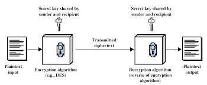

Encryption
- substitution or transformation

### Block vs Stream Ciphers
- block ciphers: process messages into bloacks, each of which is then encrypted/decrypted as a unit
    - it is a substitution on very big characters
    - 64bits or more
- stream cipher process messages a bit or byte at a time when encrypting/decrypting
    - many current ciphers are bloack ciphers
- our focus is on block ciphers

### Motivation for Feistel Cipher Structure
- a bloack cipher operated on a plain text bloack of n bits to produce a cipher tect bloack of n bits
- there are 2^n possible different plain text bloakc and for the encryption to be reversible, each must produce a unique cipher text blaock - reversible or nonsingular
- reverse mapping 2^n cipher text blocks to 2^n plain text blocks
    |plain text|cipher text|
    |---|---|
    |00|11|
    |01|10|
    |10|00|
    |11|01|

- irreversible mapping 2^n cipher text blocks to (2^n)! plain text blocks possible
    |plain text|cipher text|
    |---|---|
    |00|11|
    |01|10|
    |10|01 (same cipher text for different plain texts)| 
    |11|01 (same cipher text for different plain texts)| 
- a 4 bit i/p produces one of 16 possible i/p states, which is mapped by the substitution cipher into a unique one of the 16 o/p states, each of which is represented by 4 bit cipher text bits

fly me to the moon and let me play among the stars

let me see what spring is like on jupiter and mars

in other words, hold my hand

in other words, baby, kiss me

sing my heart with soul and let me sing forever more

you are all i long for, all i worship and adore

in other words, please be true

in other words, i love you

tun tu tun tun tu, tun tu tu tun tu tuuu

pa ra para ra ta pa ra pa pa pa

hm hmmnh hm hmmmnh h

ta ta ta, tata ta ta


### Block cipher principles
- most general form of block cipher can be used to define any reversible mapping btw plain and cipher
- feistel reffered to this as a ideal block cipher - allows for max no of possible encryption mappings from plain text bloack
- a problem exists, the system is equivalent to classical substitution cipher, which is vulnerable
- this is not due to the use of a substitution cipher rather results form the use of a small block size
- use an arbitary reversible subsitituion cipher -> statistical characteristics of the source plain text are masked and the cryptanalysis is infeasible
- for a large block size, the cipher is not practical from an implementation and performance perspective
- defining the key, the required length is (4 bits) * (16 rows) = 64 bits - for an n-bits ideal block cipher, the length is n * (2^n) bits
- for a 64 bit block, whihc is desirable length to thrwart statistical methos, the key size is 64 * 2^64 = 2^70 = 10^21 bits, which is not practical
- approximate the ideal bloack cipher by sing the idea of product cipher
- develop a bloack cipher whitha  key length of k bits and a block length of n bits, allowing a total of 2^k possible transformations, rather than 2^n!
- feistal proposed use of cipher that alternates sustitution and permutation operations, which is called a product cipher
- most symmetric bloack ciphers are based on feistal cipher structure

- class:
    - block cipher is prone to attack because the system is equivalent to a classical substitution cipher, which is vulnerable to statistical analysis
    - the use of an arbitrary reversible substitution cipher masks the statistical characteristics of the source plain text and makes cryptanalysis infeasible
    - considering large block size as a solution is not practical because the required length of the key is n * 2^n bits for n bits of input
    - an ideal bloack cipher makes use of the idea of product cipher 
    - product cipher is the combination of susbtitution and permutation operations -> proposed by feistel

### Claude Shannon and Susbtitution-Permutation Cipher
- claude shannon introduced the idea of S-P networks
- these form the basis for many modern block ciphers
- S-P networks are based on the two primitive cryptographic operations:
    - susbstitution (S-box) (confusion)
    - permutation (P-box) (diffusion)
### Confusion and Diffusion
- cipher needs to completely hide statistical properties of the plain text, which is achieved by confusion and diffusion
- confusion: makes the relationship btw cipher text and key as complex as possible
    - even if attacker can get some handle on the cipher text, the wway in which the key was used to produce that cipher text  is so complex as to make it infeasible to determine the key
- diffusion: dissipates statistical structure of the plain text over bulk of the cipher text
    - achieved by having each plain text digit affect the value of many cipher text digits
- in a binary block cipher, diffusion can be achieved by repeatedly performing some permutation on the data followed by applying a function to that permutation

## Feistal Cipher Structure
- feistel cipher:
    - based on concept of invertible product cipher [same h/w or s/w is used for encryption and decryption]
- partition the plain text bloack into two halves, L and R
    - process through multiple rounds which
    - perform a substitution on left data half
    - based on round function of right half & subkey
    - then have permutation swapping halves
- implemented based on shannon's susbtituition-permutation network (S-P network) concept
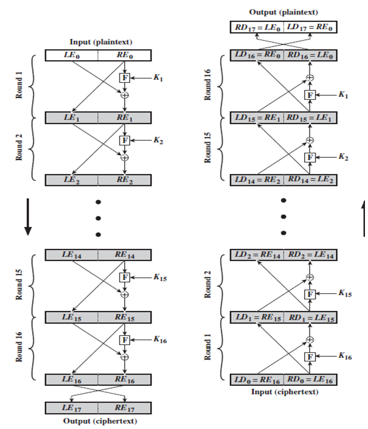

```
LE0     RE0
 \      /|
  \   /  F <- K1
   \/    |
   /\   xor
  /  \   |
 /    ---|
/        |
LE1     RE1
 \      /|
  \   /  F <- K2
   \/    |
   /\   xor
  /  \   |
 /    ---|
/        |
LE2     RE2
.
.
.
```

- The process of decryption with a Fiestel cipher is essentially the same as the encryption process.
- the rule is as follow:
    - use the cipher text as input to the algorithm, but use the sub keys Ki in reverse order
    - that is, use Kn in the first round, Kn - 1 in the second round, and so on until K1 is used in the last round.
- this is a nice feature because it means we need not implement two different algoritms, one for encryption and one for decryption.

## FIestel Cipher Design Principles
- block size:
    - increasing sizw imporves security but slows the sped of cipher
    - greater security is achieved by greater diffusion
    - traditional block size: 64bits, AES - 128bits
- key size:
    - increasing key size increases security
    - key size should be large enough to make brute-force attack infeasible
    - key size: 128 bits
- number of rounds:
    - increasing number of rounds increases security but slows the speed of cipher
    - typical number of rounds: 16
- subkey generation:
    - subkeys should be generated from the main key in a way that makes it difficult to derive the main key from the subkeys
- round function
    - should be complex enough to provide good confusion and diffusion
    - should be efficient to compute
- fast encryption and decryption:
    - the cipher should be designed to allow for fast encryption and decryption, which is important for practical use
- analysis resistance:
    - the cipher should be resistant to known cryptanalytic attacks, such as linear and differential cryptanalysis

## Data Encryption Standard (DES)
- most widely used block cipher in the world
- encrypts 64 bit data using 56 bit key and has widespread use
- it has been considered controversial because of the key length
- although DES is public, it was considerable contriversy over design 

## DES Algorithm
- des was developed in the 1970s by the nbs with the help of nsa
- des is block cipher
- encrypts 64 bit data using 56 bit key to produce 64 bit cipher text
- same algorithm is used for encryption and decryption, but the key is applied in reverse order for decryption
- 8 bits of the key are used for parity checking, so the effective key length is 56 bits
- consists of 16 steps, each of which is called as a round.
- a round performs the steps of substitution and transposition, which are based on the feistel cipher structure

- number of rounds: 16
- key size: 56 bits (effective)
- number of subkeys: 16
- subkey size: 48 bits
- cipher text size: 64 bits

```
Plain text (64 bits)
        |
        v
Initial Permutation (IP)
        |
        v
16 rounds of the following:
1. Key Transformation
2. Expansion Permutation
3. S-box Substitution
4. P-box Permutation
5. XOR and Swap
        |
        v
Final Permutation (FP)
        |
        v
Cipher text (64 bits)
```

## DES Encryption
- encryption of 64 bit data block has an initial permutation (IP) followed by 16 rounds of complex key dependednt round function involving substitution and permutation processing, and a final permutation (FP) which is the inverse of the initial permutation
- right side shows the andling of 56-bit key
- an initial permutation of the key (PC1) which selects 56-bits in two halves of 28bits
- 16 stages to generate subkey using left shift and a second permutation (PC2) 
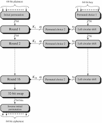

- each entry in the permutation table indicated the position of a numbered input... which also consists of 64 bits
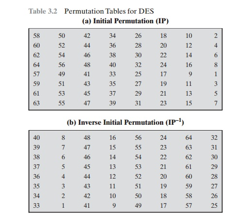

## DES Round Structure
- uses two 32 bit L & R halves
- Li = Ri-1
- Ri = Li-1 XOR F(Ri-1, Ki)
- takes 32 bits R half and 48 bit subkey and
    - expands R to 48 bits using perm E
    - adds to subkey
    - passes through 8 S-boxes to get 32-bit result
    - finally permutes this using 32 bit perm P

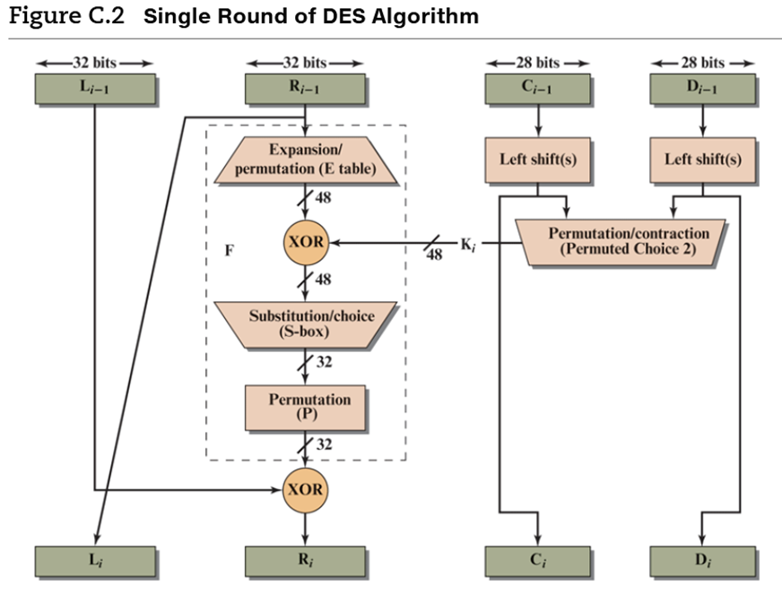


## SUbstituion
- 8 S boxes which map 6 to 4 bits
- each S box is actually 4 bit boxes
    - outer bits 1 & 6 (row bits) select one rows
    - inner 2-5 bits (col bits) are substitutes
    - result is 8 lots of 4 bits, or 32 bits
- row selection depends on both data & key
    - feature known as autoclaving (autokeying)

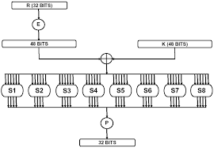
- eg: in S4, suppose input bits are 111011, then row is 11 and column is 1101, so output is 0111
- index starts from 0
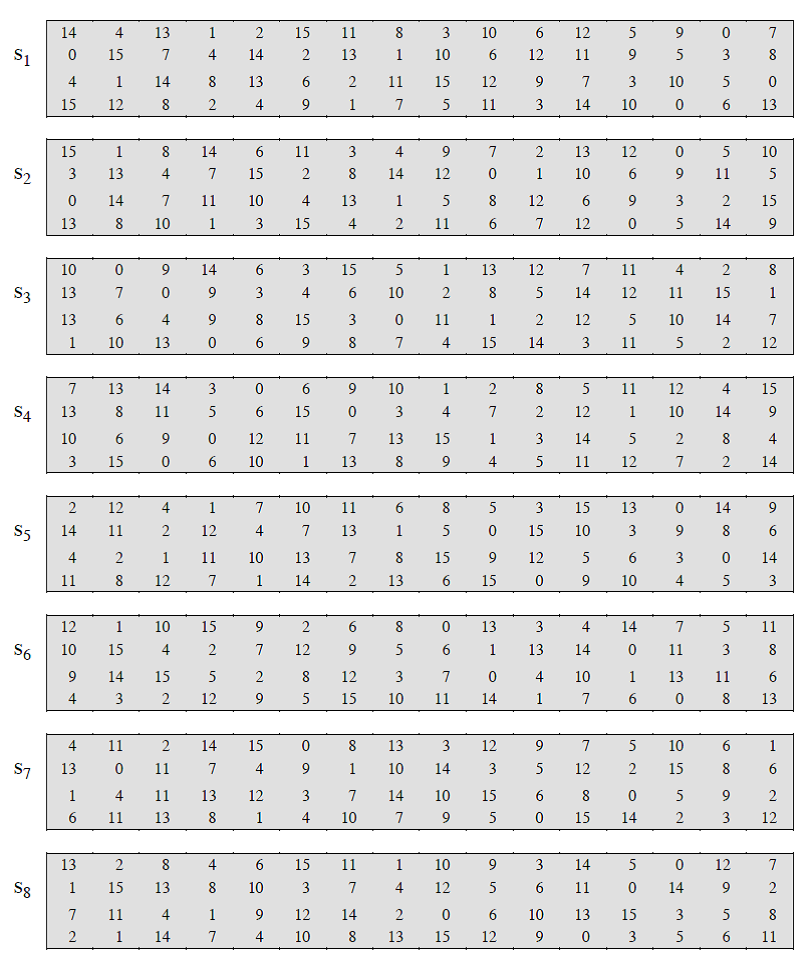


## DES Key Schedule
- subkeys used in each round consists of:
    - initial perm of the key PC1 which selects 56 bits inot 2 28 bit halves
    - 16 stages consists of:
        - 28 ...


## DES Decryption
- process of encryption in reverse order
- the output of the 16th round in encryption becomes the first round input in decryption
- K16 of encryption becomes K1 for decryption, K15 becomes K2, and so on until K1 becomes K16


## Avalanche Effect
- key derirable property of encryption algorithm
- change of one bit in the plain text or key should result in a change of many bits in the cipher text  
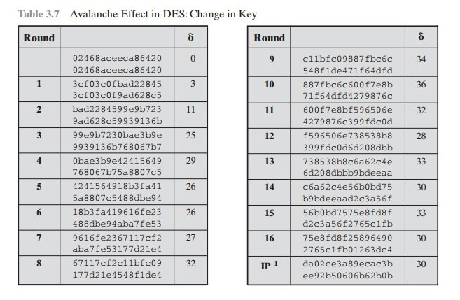

## Strength of DES - Key Size
- 56 bit keys have 2^56 possible keys, which is about 7.2 x 10^16 keys
- brute force search looks hard
- still must be able to recognise plaintext

## Strength of DES - Timnings Attack
- attaks actual implementation of cipher
- use knowledge of consequences of implementation to knowledg of someall subkey bits
- spedcifically use fact that calculations can take carying times depending on the value of some bits of the subkey

## Weakness
- Weak keys
    - the same sub key is generated for every rounf
    - DES has 4 weak keys
- semi-weak keys
    - two sub-keys are generatated on the alternate rounds
    - DES has 12 of these (6 pairs) keys
- demi-semi weak keys
    - hvae 4 subkeys generated
- weakness in cipher design
    - weakness in S-boxes
    - weakness in P-boxes
    - weakness iin key

Double DES
```
original plain text
        |
        v
16 rounds of encryption with K1
        |
        v
    Cipher text
        |
        v
    Encrypt with K2
        |
        v
    Cipher text
```
Triple DES with K1, K2, K3
```
original plain text
        |
        v
Encrypt with K1
        |
        v
    Cipher text
        |
        v
Encrypt with K2
        |
        v
    Cipher text
        |
        v
Encrypt with K3
        |
        v
    Cipher text
```
Triple decryption with 2 keys
```
original plain text
        |
        v
Encrypt with K1
        |
        v
    Cipher text
        |
        v
Decrypt with K2
        |
        v
    Cipher text
        |
        v
Encrypt with K1
        |
        v
    Cipher text
```

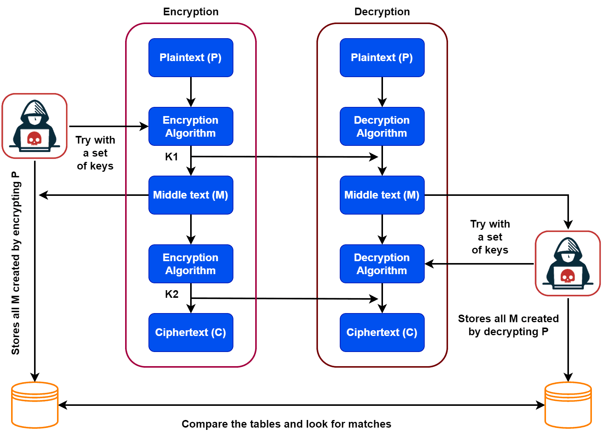

- The plaintext and ciphertext are each 4 bits long and the key is 3 bits long. Assume that the function takes the first and third bits of the key, interprets these two bits as a decimal no, squares the no, and interprets the result as a 4 bit binary pattern. shor the results of the encryption of the plaintext 0111 using the key 101, and the decryption of the resulting ciphertext using the same key. Encryption and decryption uses XOR operation.
- Encryption:
    - key: 101 -> 11 (binary) 3 (decimal) -> 9 (decimal) -> 1001 (binary)
    - plaintext: 0111
    - ciphertext: 0111 XOR 1001 = 1110
- Decryption:
    - key: 101 -> 11 (binary) 3 (decimal) -> 9 (decimal) -> 1001 (binary)
    - ciphertext: 1110
    - plaintext: 1110 XOR 1001 = 0111

- the input to Sbox 5 is 100011, what is the output?
    - row: 11 (binary) 3 (decimal)
    - column: 0001 (binary) 1 (decimal)
    - output: 8

- for S box 3 the input is 111011, what is the output?
    - row: 11 (binary) 3 (decimal)
    - column: 1101 (binary) 13 (decimal)
    - output: 5 ( we got 5 because the value at row 3 and column 13 in S box 3 is 5)

## Advanced Encryption Standard (AES)
- the more popular and widely adopted symmetric encryption algorithm in the Advanced Encryption Standard (AES)
- it is found at least six times faster than triple DES
- a replacement for des was needed as its key size was too small. with increasing computing power, it was considered vulnerable against exhaustive key search attack. triple des was proposed as a solution, but it is slow. 
- DES -> double DES -> triple DES -> AES
- symmetric key, symmetric block cipher
- 128 bit data, 128/192/256 bit keys
- stronger and faster than triple DES
- Operation of AES
    - iterative
    - based on susbtitution-permutation network
    - comprises of series of linked operation, some of which involbe replacing input by specific output (substitution) and others involve shuffling bits around (permutation)
    - aes performs all its computation on bytes rather than bits
    - aes treats the 128 bits of plaintext block as 16 bytes arranged in a 4x4 matrix, which is called the state
    - the number of rounds is variable and depends on the length of key
    - aes uses 10 rounds for 128 bit keys, 12 rounds for 192 bit keys, and 14 rounds for 256 bit keys
    - each of these rounds uses a different 128-bit round key, which is calculated from the original aes key
    - based of the key size, different number of rounds are used

    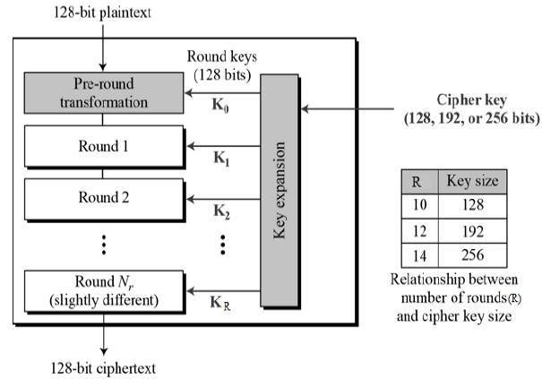
    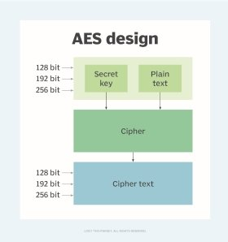

- each round has 4 different sub processes:
    - subsitution bytes (sub bytes): 16 input bytes are substitued by looking up a fixed table (s-box) given in design -> matrix of four rows and columns
    - shift rows: each row of the 4 rows is cyclically shifted to the left where there is no shift for the first row, one shift for the second row, two shifts for the third row, and three shifts for the fourth row
    - mix columns: the plain text matrix is transformed using a matrix multiplication with a fixed value matrix
    - add round key: xor operation is formed in betweeen 128 bit of plain text matrix and 128 bits of round key
    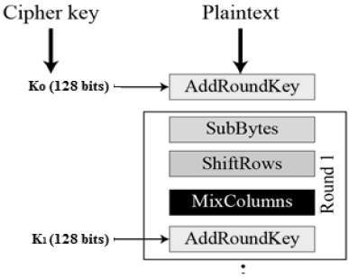
- in the decryption process, there is a need for sperate algoerithm unlike des becaause every round consists of 4 sub processes conducted in reverse orde.
    - the process of decryption is the same as encryption, but the order of the round keys is reversed and the order of the four sub processes in each round is also reversed

- sub bytes
    - each byte is replaced by byte indexed by row (left 4 bits) & column (4bits) of a 16x16 table
    - encryption: 98 -> 90 row and 08 column -> 46 in rijndael s-box
    - decryption: 46 -> 04 row and 06 column -> 98 in inverse rijndael s-box
    - decryption: 90 -> 90 row and 00 column -> 96 inverse rijndael s-box
        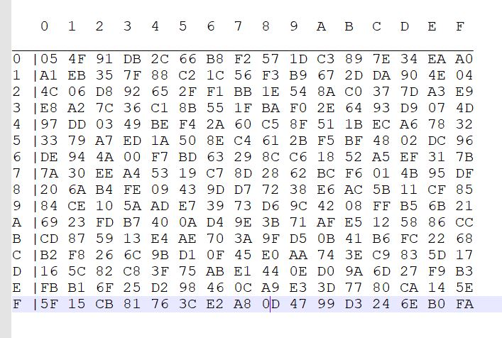

- shift rows
    - 1st row: no shift
    - 2nd row: shift left by 1
    - 3rd row: shift left by 2
    - 4th row: shift left by 3
    - before
    ```
    87 F2 4D 97
    EC 6E 4C 90
    4A C3 46 E7
    8C D8 95 A6
    ```
    - after
    ```
    87 F2 4D 97
    6E 4C 90 EC
    46 E7 4A C3
    A6 8C D8 95
    ```

- mix columns
    - effectively a matrix multiplication in GF(2^8) using prime polynomial x^8 + x^4 + x^3 + x + 1
    - we use xor instead of addition
    - fixed value matrix used everytime for mix column in every round
    ```
    02 03 01 01
    01 02 03 01
    01 01 02 03
    03 01 01 02
    ```
    - first row, first column: (02 x 87) xor (03 x 6E) xor (01 x 46) xor (01 x A6)
    - rules for the multiplication:
        - multiply by 01, no change
        - multiply by 02, 
            - if msb is 1 before shifting, then shift left by 1 bit then xor with 1B
            - if msb is 0 before shifting, then shift left by 1 bit
        - multiply by 03, multiply by 01 xor multiply with 10

    - A6 x 01 = A6
    - 87 x 02 = 10000111 -> 00001110 -> 1B xor 0E = 15
    - 03 x F2 = 02 x F2 xor 10 x F2
        - 02 x F2 = 1B xor E4 = FF
        - ...
    - (02 x 87) xor (03 x 6E) xor (01 x 46) xor (01 x A6) = 15 xor FF xor 46 xor A6 = 47
        - 02 x 87 = 15
        - 03 x 6E = (01 x 6E) xor (10 x 6E) 
            - 6E
            - (02 x 6E) = 02 x 01101110 = 02 x 11011110
        - 01 x 46 = 46
        - 01 x A6 = A6
        - 15 xor FF xor 46 xor A6 = 47

- adding round key
    - 128 bit round key is xored with 128 bit state matrix
    - convert every cell into 8 bits
    ```
    01 89 fe 76             0f 47 0c af
    23 ab de 54             15 d9 b7 7f
    45 cd ba 32     xor     71 e8 ad 67
    67 ef 98 10             c9 59 d6 98
    ```
    = 
    ```
    0e ce f2 d9
    36 72 6b 2b
    34 25 17 55
    ae b6 4e 88
    ```
    - every column is representing a word:
        - word size is 32 bits
        - w0 = 0f 15 71 c9
        - w1 = 47 d9 e8 59
        - w2 = 0c b7 ad d6
        - w3 = af 7f 67 98
    
## AES Key expansion
- use four byte word called wi . subkey = 4 words

for aes-128:
- first subkey (w3, w2, w1, w0) = cipher key
- other words are calculated as follows:
    - if i mod 4 != 0, then wi = wi-1 XOR wi-4
    - for i mod 4 == 0,
        - w4k = rsk xor w4k-4 xor rconck
        - RotWord: bytes of w4k-1 are rotated left shift (nonlinearity)
        - SubWord: subbytes fn is apploed to all four bytes (diffusion)
        - the result rsk is xored with w4k-4 and round contant rconck to get w4k
        - Rcon[i]: is a round constant word array, which is different for each round
- to find out words for every round, the rules are as follows
    - wi = wi-1 XOR wi-4 where i is not a multiple of 4
        - ex: w5, w6, w7, w9
    - w4k = r_sk XOR w4k-4 XOR r_conk where the word is a multiple of 4
        - r_sk is the combination of RotWord and SubWord function
        - RotWord is the left circular shift of the previous work
        - SubWord is the susbtitution of the shifted word using the s-box
        - r_conk has fixed value for each round (predefined)
    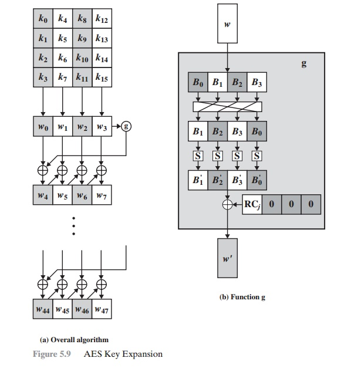
    
    
    - each round key in aes depends on the previous round key. the dependency, however, is nonlinear because of the SubWord transformation
    - the addition of the round constants also guarentees that each round key is different, which is important for security.

## attacks on aes encryption
- a possible related-key attack: crack cipher by studying how it operated under different keys. threat only to aes systems that are incorrectly configured
- known-key attack against aes-128. used to discern the structure of encryption/ hacker only targeted an 8 round version of aes rather than the standard 10 rounds, so the threat is relatively low
- major risk: side channel attack. aimed at picked ip leaked information from the system. 

## Electronic Code Book (ECB)
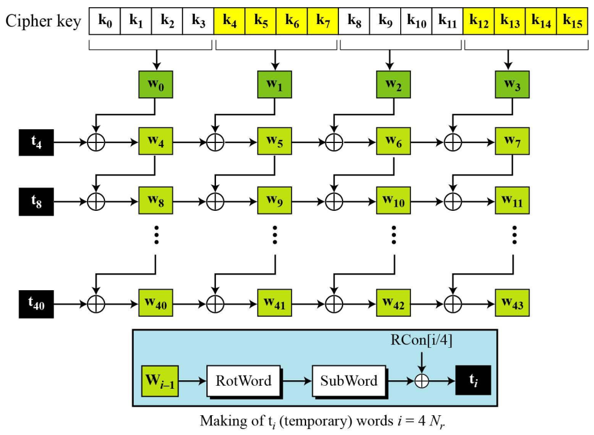
- each bloack is encoded independently of the other blocks

## Cipher Block Chaining (CBC)
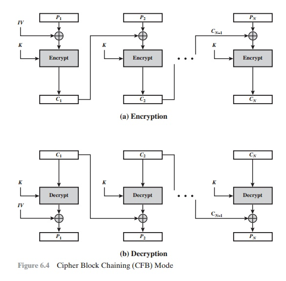
- each previous cipher blocks is chained with the current plaintext bloack, hence the name
- use Initial Vector (IV) to start the process

## Cipher Feedback (CFB)
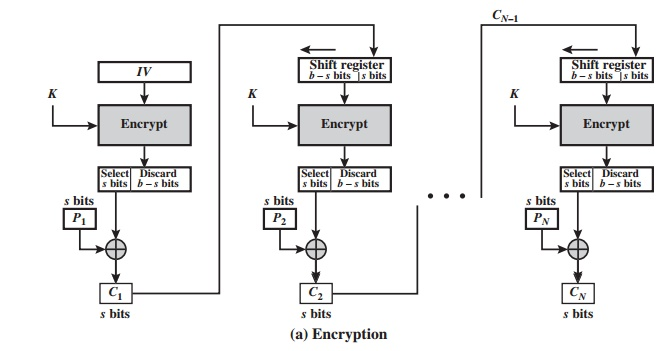

## Counter
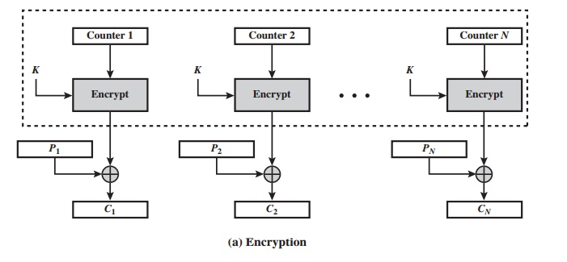