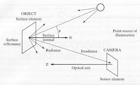
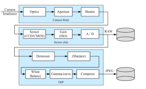
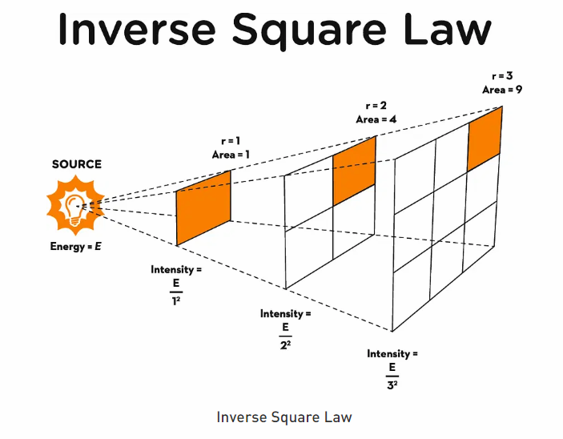
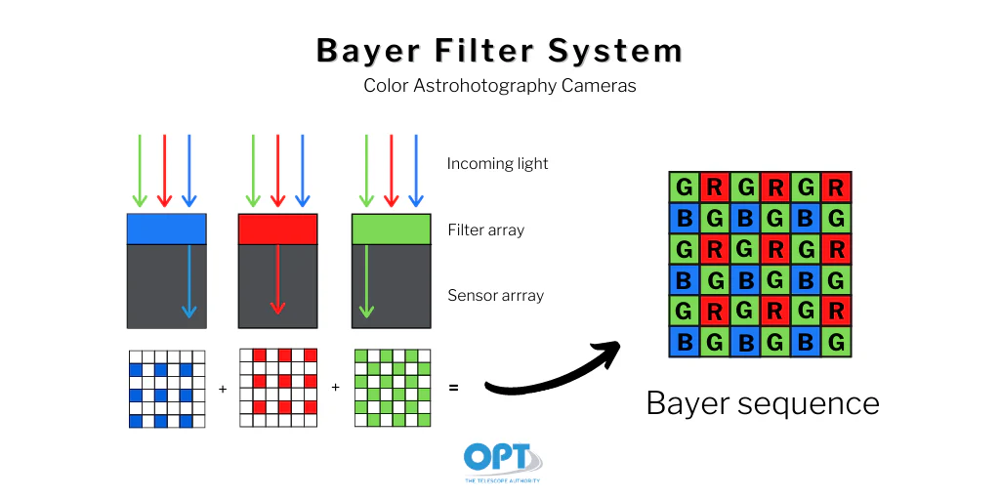

# Metrics in Radiometry and Photometry
- Radiance
- Radiant flux
- Luminous flux
- Illuminance
- Luminance
- Reflectance
- Radiant Intensity: power per unit solid angle
- Luminous Intensity: visible power per unit solid angle
- Irradiance: power incident per unit area E = dΦ/dA
- Illuminance: visible power incident per unit area

#### A simple model of image formation

- radiance: light falling on a surface from a particular direction
- irradiance: total light falling on a surface from all directions

#### Photometric Image formatation
- after starting from one or more lught sources, light interacts with the scene surfaces and is eventually recorded by a camera
- the photons arriving at the camera sensor are converted into an electrical signal, which is then digitized (RGB values) to produce a digital image

- Camera irradiance -> Camera Body (Optics -> Aperture -> Shutter) -> Sensor Chip (Sensor (CCD/CMOS) -> Gain -> A /D Conversion) -> Digital Image (RAW) -> Image Processing (Demosaicing -> Sharpen -> White Balance -> Gamma/curve -> Compression) -> Final Image (JPEG)



- The first part of camera which interacts with the photons of light forom the environment is the optics (lens) of the camera
- Aperture: opening in the lens that controls the amount of light reaching the sensor
- Shutter: mechanism that opens and closes to control the duration of light exposure on the sensor

    Sensors:
    - CCD (Charge-Coupled Device) and CMOS (Complementary Metal-Oxide-Semiconductor) are two types of image sensors used in digital cameras
    - Both types of sensors convert incoming light (photons) into electrical signals (electrons)
    - CCD sensors transfer the charge across the chip and read it at one corner, while CMOS sensors have amplifiers at each pixel, allowing for faster readout and lower power consumption


- Gain: amplification of the electrical signal to improve sensitivity (low light conditions)
- Demosaicing: process of reconstructing a full-color image from the incomplete color samples output by the image sensor
- White Balance: adjustment of colors to make the image appear more natural under different lighting conditions
- Gamma/curve: non-linear operation used to encode and decode luminance or tristimulus values in images to account for human perception. Involves applying a power-law function to the pixel values to account for non-linear response of display devices and human vision
- Compression: reducing the file size of the image for storage and transmission, can be lossy (JPEG) or lossless (PNG)

### Photometric Image Formation Model
- 3D geometric feature in the owrld are projected onto a 2D image features in an image

#### Lighting
- images cant be formed without light
- to produce an image, the scene must be illuminated by one or more light sources
- light sources can be point sources (sun, light bulb) or area sources (windows, fluorescent lights)
- A point light source emits light uniformly in all directions from a single point in space
- An area light source emits light from a surface area, resulting in softer shadows and more diffuse illumination. They are used to light up large area with more even lighting.
- Other lights are volume lights, ambient lights, spot lights etc
- The intesity fo the light falls of with distance according to the inverse square law: I ∝ 1/d^2 (the same light spreads over a larger area as the distance increases, it may also have a directional faloff )
        

Reflectance and Shading
- the amount of light arriving and reflecting can be defined by various models/function:
- THe most general mosel is the Bidirectional Reflectance Distribution Function (BRDF) which defines how light is reflected at an opaque surface
- other models-diffuse, specular, phong

- they can be used to compute the global corresponding ...

- Directions from light arriving at a surface point to the viewer and from the light source to the surface point matter

BRDF
- help find the relationship between incoming light and outgoing light at a surface point
- tell us the directional distribution

Irradiance Ei = 80 W/m^2
- Radiance Lo = 12 W/m^2/sr

BRDF: fr = Lo / Ei = 12 / 80 = 0.15875 sr^-1
p = pi * fr = pi * 0.15875 = 0.5

Albedo
- the fraction of light that is reflected by a surface

After light is reflected:
- BRDF determines how light is reflected
- BRDF function explains how the icident light energy is distributed in different directions after reflection from a surface

Light enters into sensor
- light is a mixture of different wavelengths
when light is entering the sensor palne, we get photon energy which is a mix of colours

Sensors do not measure individual photons energies directly. they measure energy per unit time
if n photons arrive per second, Phi = N . E(photon)

Radiant Power -> Irradiance/illuminance at the surface 
when light reaches a surface on area A : Ei = dphi / dA

L (Luminance/radiance) = fr E

The sensor measures the luminance/radiance of the light as per any of the model like BDRF fr,

fr = L (Luminance/radiance) / E (Irradiance/illuminance)

Intensity = L A cos(theta) 
Light intensity -> Electrical signal

### Intensity of Sensor/Analog signal to Bayer Image
- filter so that one pixel only gets one colour information
- Bayer filter helps filtering colours in analog signal to digital signal
- Analog -> (Bayer Filtering -> ADC -> RAW Bayer Image) -> Demosaicing
- Bayer filter mosaic is a color filter array (CFA) for arranging RGB color filters on a square grid of photosensors

### Intensity to colour
Spectral responses of Cones -> Bayer filter
one pixels value is a mix of colours, when it passes through bayer filter, it filters out one colour and passes other two colours



Colour filter array: CFA: Bayer filter
1. Colour filter array (CFA) is a mosaic of tiny colour filters placed over the pixel sensors of an image sensor to capture color information
2. Intensity per channel is recorded. THe intensity value at each pixel corresponds to the amount of light that passed through the respective color filter (Red, Green, or Blue)
3. Combining Channels (Demosaicing): The raw image data from the sensor contains intensity values for each color channel at each pixel location. Demosaicing algorithms are used to interpolate and combine these values to reconstruct a full-color image

it has 50% green, 25% red, 25% blue filters because human eye is more sensitive to green light, which improves perceived image sharpness and detail

### Standard Bayer Pattern
- the rows altenrate between "R-G-R" and "G-B-G" pattern, this structure is often referred to as the "RGGB" pattern or "R-G-B-G" pattern.
```
R G R  
G B G 
R G R 
```

### Altenative Bayer Patterns
The pattern is comomon especially in consumer cameras, but there are alternative patterns used in some specialized applications:
```
G R G R G
B G B G B
G R G R G
B G B G B
G R G R G
```

Identify the red green and blue pattern matrices (digital form) in the given Bayer data-digital form (assume it follows GRBG)
```
50 200 60 210
30 80 40 100
70 190 90 220
20 120 10 130
```

Red
```
0 200 0 210
0 80 0 100
0 190 0 220
0 120 0 130
```

Demosacing is the digital image processing technique used to reconstruct a full-color image from the incomplete color samples output by the image sensor overlaid with a color filter array (CFA) such as the Bayer filter.

Resonctruction of full colour image from bayer image is done by demosaicing.

demoisaicing or debayering is the digital process step used to reconstruct a full-color RBG image from a RAW bayer image, where each pixel contains only one color component. the bayer filter allows each pixel to capture only one color (R, G or B)
RAW Bayer Image -> Demosaicing -> Full Colour Image

Interpolation techniques
1. Nearest Neighbor Interpolation: Assigns the value of the nearest known pixel to the missing color channel.
- Example
    - Assume we have a 2x2 bayer pattern:
    RGB of (0, 0)?
    ```
    [G=120 R=200
     B=100 G=130]
     ```
    - RGB at (0,0) = (200, 120, 100)
    - RGB at (0,1) = (200, 120, 100)
    - RGB at (1,0) = (200, 120, 100)
- one of the nearest values is chosen if there are more neighbours
- we usually take the top/left pixel value
- Advantage: Simple and fast
- Disadvantage: Can produce blocky artifacts and loss of detail especially in the edges

2. Bilinear Interpolation: Averages the values of the four nearest known pixels to estimate the missing color channel.
- closer neighbours have more weightage
- boundary pixels may only have partial neighbours, and the interpolation is done accordingly
- Example:
    ```
    G=120 R=200 G=130
    B=100 G=150 B=110
    G=125 B=105 R=220
    ```
    For the blue pixel at (2,1): B=105, G=(150+125/2)=137.5, R=220
    (consider 8 nearest neighbours if the color is missing)

3. Gradient-Based Interpolation: Considers the gradients in the image to preserve edges while interpolating missing color channels.
- 

x x x x x
x P P P x
x P O P x
x P P P x
x x x x x


### Write a pythin code that generates 256 x 256 image as below
- in this image, the value of each pizel in the ith row of the red channel is i*0.0039
- the value of each pixel in the ith row of the green channel is 1 - i*0.0039
- the value of each pixel in the ith row of the blue channel is 1
try changing the channel values to generate different patterns

White balancing: the cruical step to correct the color balance of an image so that it appears natural under different lighting conditions
the sensor output form a camera often has a color cast dur to the light source (er sunlight, incadescent light, fluorescent light) 

- camera captures color according to the light source
- it can be changed by adjusting the color temperature settings in the camera

#### Gamma Correction
- achieves linearity by applying an inverse powe law transforma at one stage and reversing it at another stage. the key idea os that linearity is required for computation, which nonlinearity is preferref for storage and transmission
- nonlinear proces that adjust the brightness and darkness of images to match how humans se. its used to compensate for the non linearity of image capturing devices and displays
- it is required because the image capture, dispaly devices and human vision do not respond linearly to light intensity
- without compensation, images would appear too dark, washed out or perceptually inaccurate

### what is gamma?
- voltage level to brightness level mapping

linear ramp: easy to distinguish colors
### Non linear device response
Most display devices follow a power-law resposnse
L = V^γ
where L is the emitted luminance, V is the voltage input/ pixel value to the display, and γ (gamma) is a constant that characterizes the non-linearity of the display device. Doubling V does not double L.

### Steps involved in Gamma correction of an image
1. Iverse Gamma (Gamma Encoding): during storage or transmission, we apply the inverse value of gamma: V = L^(1/γ) to the pixel values to encode them. Compresses high-intensity values more than low-intensity values
2. Gamma Decoding (Reversing the inverse): when displaying the image, we apply the gamma correction: L = V^γ to the pixel values to decode them back to their original luminance levels
```L_disp = V^γ```
Substituting V from the encoding step:
```L_disp = (L^(1/γ))^γ = L```
3. Result: the displayed luminance L_disp matches the original luminance L, ensuring accurate representation of brightness levels on the display device

- ensures that there is compression during storage/transmission and accurate representation during display 


## Image Compression
- JPEG: (Joint Photographic Experts Group) is a widely used lossy image compression standard that reduces file size by discarding some image data, especially in areas with less visual importance. maintains acceptable visual quality while significantly reducing file size

### Image compression
- JPEG: lossy compression method that reduces file size by discarding some image data, especially in areas with less visual importance

### Chrominance reduction in compression
- Convert RGB to YCbCr color space and averaging the chrominance channels (Cb and Cr) to reduce their resolution while keeping the luminance channel (Y) at full resolution

1. Color Space Conversion: Convert the image from RGB to YCbCr color space, where Y represents luminance (brightness) and Cb and Cr represent chrominance (color information)
2. Downsampling: Reduce the resolution of the chrominance channels (Cb and Cr) by averaging neighboring pixels. Common downsampling ratios are 4:2:2 or 4:2:0, meaning that for every 4 luminance samples, there are 2 chrominance samples in each channel (Cb and Cr)
3. Block Splitting: Divide the image into 8x8 pixel blocks for further processing
4. Discrete Cosine Transform (DCT): Apply DCT to each 8x8 block to convert spatial domain data into frequency domain data
5. Quantization: Reduce the precision of the DCT coefficients using a quantization matrix, which helps to discard less important frequency components
6. Encoding: Use entropy coding techniques like Huffman coding or Run-Length Encoding (RLE) to further compress the quantized DCT coefficients
7. Result: The final compressed image contains reduced chrominance information, leading to smaller file size while maintaining acceptable visual quality

RGB_mat = 
```
(100, 150, 200)     (110, 155, 205)     (120, 160, 210)     (130, 165, 215)
(105, 152, 202)      (115, 157, 207)      (125, 162, 212)     (135, 167, 217)
(140, 170, 220)      (150, 135, 185)      (95, 140, 190)      (105, 145, 195)
(70, 120, 170)      (75, 125, 175)      (85, 130, 180)      (95, 135, 185)
```
(last 2 rows are wrong)

```
Y = 0.299 R + 0.587 G + 0.114 B
Cb = 128 - 0.168736 R - 0.331264 G + 0.5 B
Cr = 128 + 0.5 R - 0.468736 G - 0.081264 B
```

Y matrix =
```
(140.75)   (142.07)   (147.07)   (152.07)
(139.87)   (144.87)   (149.87)   (154.87)
(126.22)   (131.22)   (136.22)   (141.22)
(116.57)   (121.57)   (126.57)   (131.57)
```
Cb matrix =
```
(161)   (141.29)   (136.29)   (131.29)
(144.49)   (139.49)   (134.49)   (129.49)
(154.14)   (149.14)   (144.14)   (139.14)
(159.79)   (154.79)   (149.79)   (144.79)
```
Cr matrix =
```
(99)   (128.43)   (133.43)   (138.43)
(125.23)   (130.23)   (135.23)   (140.23)
(112.58)   (117.58)   (122.58)   (127.58)
(107.93)   (112.93)   (117.93)   (122.93)
```