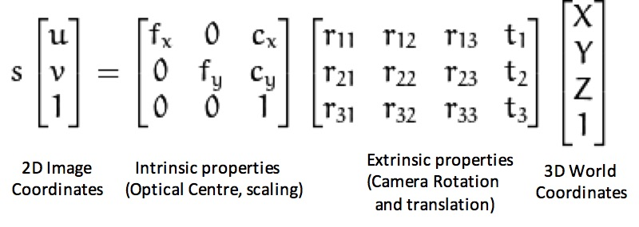

# Camera Calibration
- Camera calibration is the process of estimating the parameters of a camera to understand how it captures images of the 3D world.
- Why?
    - To correct lens distortions
    - To understand the relationship between 3D world coordinates and 2D image coordinates
    - To enable accurate measurements and 3D reconstructions from images
- It is a mathematical decription of the imaging process, allowinf comp vision to correct distortions, accurately intrpret the scene, and perform measurements.

A Fundamental problem:
- a real camera is nto an ideal pinhole camera
- every camera has:
    - unknown focal length
    - principal point (optical center) not at the image center
    - aspect ratio not equal to 1
    - lens distortions (radial and tangential)
    - sensor gain and offset differences

Essential Parameters:
- Intrinsic Parameters: internal characteristics of the camera. K =
    ```
    fx 0 cx
    0 fy cy
    0 0 1
    ```
    - where:
        - focal length (fx, fy)
        - principal point (cx, cy)
        - radio distortion coefficients (k1, k2, p1, p2, k3)

- Extrinsic Parameters: position and orientation of the camera in the world. [R|t]
- Rotation Orientation Matrix (R): orientation of the camera
- Translation Vector (t): position of the camera

- u & v represent the pixel coordinates in the image plane

Distortion:
- radial distortion: straight lines appear curved
    - becomes larger the farther points are from the image center
    ```
    x_distorted = x * (1 + k1*r^2 + k2*r^4 + k3*r^6)
    y_distorted = y * (1 + k1*r^2 + k2*r^4 + k3*r^6)
    ```
- tangential distortion: occurs when the lens and image plane are not parallel
    ```
    x_distorted = x + [2*p1*x*y + p2*(r^2 + 2*x^2)]
    y_distorted = y + [p1*(r^2 + 2*y^2) + 2*p2*x*y]
    ```
    - where r^2 = x^2 + y^2
    - x, y are the normalized coordinates
    - p1 and p2 are tangential distortion coefficients


Applications of Camera Calibration:
- accurate 3D-to-2D projections
- removal of lens distortions
- improve computer vision algorithms
- calibration in multiple camera systems
- augmented reality