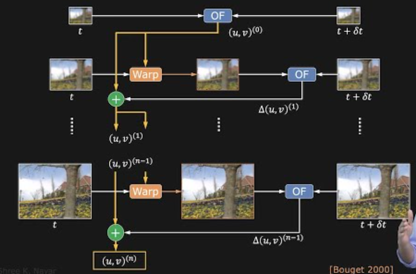

# Motion Field and Optical Flow

## Motion Detection:
- method to estimate the apparent motion of scene points in a sequence of images
- important topics: motion field, optical flow, optical flow constraint equation, lucas kanade method, coars to fine flow estimation, motion segmentation

## Motion Field:
- 3D vector field that reprsents the velocity of points in a 3D scene as they project onto a 2D image plane
- describes the true 3D motion of objects in the scene, but is not directly observable from 2D images
- Characteristics:
    - it is a 3D phenomenon projected onto a 2D image plane
    - it depends on the 3D structure of the scene and the 3D motion fo the camera and objects
    - genrally continous, except at object boundaries
- Factors affecting motion field:
    - camera motion: translation and rotation of the camera
    - object motion: movement of objects in the scene
    - depth of scene: distance of objects from the camera

## Optical Flow:
- 2D vector field that represents the apparent motion of brightness patterns in a sequence of images
- it is an approximation of the motion field (estimation the motion of pixels btw frames), but can be computed directly from image data
- Characteristics:
    - it is a 2D phenomenon observed in image sequences
    - it depends on the brightness patterns in the images, which may not always correspond to actual motion
    - it is an approximation of the motion field, and they are not always identical
    - can be affected by illumination changes, and textureless areas 
- Assumptions:
    - brightness constancy: assumption that the brightness of a point in the scene remains constant over time
    - small motion: assumption that the motion between frames is small, allowing for linear approximations
    - spatial coherence: assumption that neighboring pixels have similar motion


## Relationship between Motion Field and Optical Flow:
- optical flow is an approximation of the motion field, but they are not always identical
- the motion field is the true 3D motion projected onto the image, while optical flow is the apparent motion of brightness patterns in the image
- in ideal connditions (no illumination changes, small motion), optical flow can be a good approximation of the motion field
- if there are significant illumination changes, large motion, or textureless areas, the optical flow may not accurately represent the motion field
- the motion is the property of the 3D scene, while optical flow is a property of the 2D image sequence
- knowing the depth of the scene can help in estimating the motion field from optical flow, as it provides information about the 3D structure of the scene

|Feature|Motion Field|Optical Flow|
|---|---|---|
|Dimensionality|3D projected to 2D|2D|
|Represents|True 3D motion|Apparent motion of brightness patterns|
|Dependence|Depends on 3D scene structure, camera/object motion|Depends on brightness patterns|
|Assumptions|None|Brightness constancy, small motion, spatial coherence|
|Goal|Velocity of points in 3D scene|Motion of pixels in image sequence|

## Applications:
- optical mouse
- traffic monitoring: vehicle speed
- image stabilization: compensate for camera shake
- face tracking
- gaming: playing with virtual ball

## Optical FLow - Structure from Motion:
- Motion ...

## When is Optical Flow != Motion Field?
- motion field exists while spinning, there is no optical flow because the brightness patterns do not change (Spinning sphere, stationary light source)
- motion field doesnt exist, there is optical flow because the brightness patterns change (Stationary sphere, moving light source)
- barber pole illusion: motion field is ambiguous, but there is optical flow due to the changing brightness patterns

## Estimation of optical flow
- it is an under contrained problem
- first find the constrain equation
- then use algorithm to solve for the flow

## Assumptions
- intensity(x, y, t) = intensity(x + dx, y + dy, t + dt)
- displacment (dx, dy) and time step dt are small

## taylor series explansion
- useful linear approxiamation based on taylor series function
- I(x + dx, y + dy, t + dt) = I(x, y, t) + (dI/dx) * dx + (dI/dy) * dy + (dI/dt) * dt
- I(x + dx, y + dy, t + dt) = I(x, y, t) + Ix * dx + Iy * dy + It * dt
- constraint equation: Ix * u + Iy * v + It = 0 with (u, v) = optical flow

## speed and direction of pixel
- speed = sqrt(x^2 + y^2)
- direction = theta = tan-1(v/u)

- example: I(x, y, t) = 100
    - t + dt is I(x + dx, y + dy, t + dt) = 103
    - Ix = dI/dx = 1, Iy = dI/dy = 2
    - It = dI/dt = 3
    - constraint equation: 1 * u + 2 * v + 3 = 0
    - u + 2v = -3
    - let u = -1, then v = -1
    - let v = -1, then u = -1
    - speed = sqrt((-1)^2 + (-1)^2) = sqrt(2) = 1.41
    - direction = theta = tan-1(-1/-1) = tan-1(1) = 45 degrees
        - third quadarnt => 180 + 45 = 225 degrees is the direction of the pixel motion

- I(x, y, t) = 
```
10  15  20
25  30  35
40  45  50
```
- Image at time t + 1 I(x, y, t + 1) = 
```
11  16  21
26  31  36
41  46  51
```
Ix(t) = 
```
7.5    5   -7.5
15     5   -15
22.5   5   -22.5
```
Ix(t + 1) = 
```
8       5    -8
15.5    5   -15.5
23      5   -23
```
Iy(t) = 
```
12.5  15.5  17.5
15    15    15
-12.5  -15  -17.5
```
Iy(t + 1) = 
```
13      15.5    18
15      15      15
-13     -15.5   -18
```

## Lucas Kanade Method:
- the constraint eq is an aperture problem, we have one equation with two unknowns (u, v) -> insufficient to solve for optical flow
- We need to add more constraints to solve for optical flow
- Lucas Kanade method: assumes that the optical flow is constant within a small neighborhood around each pixel, allowing us to use multiple constraint equations to solve for the flow
- this allows for creation of a system of equations by considering multiple pixels in the neighbourhood
- solved usign least squares method
- Ix(k, l)u + Iy(k, l)v + It(k, l) = 0 for all pixels (k, l) in the neighborhood
 Let A (n^2 * 2) be the matrix of spatial gradients, -b (n^2 * 1) be the -ve vector of temporal gradients, and x (2 * 1) be the vector of optical flow (u, v)
- A = [[Ix(k, l), Iy(k, l)] for all pixels (k, l) in the neighborhood]
- -b = [It(k, l) for all pixels (k, l) in the neighborhood]
- u [u v]
- A'Au = A'B
- compute A'A and A'B
- A'A = 
```
sum(IxIx)   Sum(IxIy)
sum(IxIy)   Sum(IyIy)
```
- A'B = 
```
sum(-IxIt)
sum(-IyIt)
```
- u = (A'A)^-1 A'B (Fast and easy to solve)
- it becomes very easy as:
    - u and v are 2 unknowns
    - it just becomes 2 x 2 matrix - very easy to invert 
- Conditions:
    - A'A must be invertible, which means that the matrix must have full rank (rank 2)
    - A'A must be well conditioned, which means that the eigenvalues of A'A should not be too small (to avoid numerical instability)
    - If e1 and e2 are the eigenvalues of A'A, then we need e1 > e, e2 > e and e1 >= e2 but not e1 >>>> e2

Scenarios:
- Badly conditioned, prominent gradient in one direction, aperture problem
- well conditioned. large and diverse gradients magnitudes, can reliably compute optical flow

- example: 
    - pixel 1: (1, 2, -1)
    - pixel 2: (2, 1, -2)
    - pixel 3: (1, 1, -1)
- A = [[1, 2], [2, 1], [1, 1]]
- -b = [[-1], [-2], [-1]]
    - sum(IxIx) = 1^2 + 2^2 + 1^2 = 6
    - sum(IxIy) = 1*2 + 2*1 + 1*1 = 5
    - sum(IyIy) = 2^2 + 1^2 + 1^2 = 6
    - sum(IxIt) = 1*-1 + 2*-2 + 1*-1 = -6
    - sum(IyIt) = 2*-1 + 1*-2 + 1*-1 = -5
- A'A = [[6, 5], [5, 6]]
- A'B = -[[-6], [-5]] = [[6], [5]]
- u = (A'A)^-1 A'B
- A'A^-1 = 1/(6*6 - 5*5) * [[6, -5], [-5, 6]] = 1/11 * [[6, -5], [-5, 6]]
- u = 1/11 * [[6, -5], [-5, 6]] * [[6], [5]] = 1/11 * [[36 - 25], [-30 + 30]] = [[11/11], [0/11]] = [[1], [0]]

## Coarse to Fine Flow Estimation:
- the coarse-to-fine approach involves starting with the lowest resolution images and applying an optical flow algorithm to eastimate the flow, which is then used to warp the image in the next higher resolution.
- this procss is repeated untilt he highest resolution images are reaches, resulting in the final optical flow estimation

## Resolution pyramid:
- the resolution pyramid concept involves computing a series of images at different resolutions, typically by downsampling the original image. This allows for the estimation of optical flow at multiple scales, which can help to capture both large and small motions in the scene. The optical flow is first estimated at the lowest resolution, and then refined at higher resolutions using the previous estimates as a starting point.
- compute lower res version of two consecutive frames (e.g., by downsampling) by taking 2x2 window in one of the images, finding the average of the 4 pixels, and using that as the pixel value in the lower res image

- the final u, v is the optical flow btw two images

## Different approaches to motion estimation
- sparse motion estimation: only estimate motion for a subset of pixels (e.g., corners or edges)
    - tracking the movement of a limites set of distinct features within an image sequence
    - applications: object tracking, feature-based video analysis, and structure from motion
- dense motion estimation: estimate motion for every pixel in the image 
    - determines the motion of every pixel within an image sequence
    - each pixel has motion vector
    - video stabilization, motion segmentation, and action recognition, video compression, 3D reconstruction, robotics and autonomous driving

## Advacnced Motion 
- we talk about layered and parametric motion estimation offere more sophisticated ways to model and understand motion
- aim to capture higher level motion patterns and object behaviour

### Layered Motion
- segments the video into multiple layers, each respresenting a seperate moving object or region
- output: motion field for each layer, which can be used to analyze the motion of individual objects or regions in the video
- applications: video segmentation, object tracking, and scene understanding, video compression

### Parametric Motion Estimation
- descrive using mathematical models (e.g., affine, homography) to represent the motion of objects or regions in a video
- common parametric models
    - translation
    - rotation
    - affine transformation
    - homography
