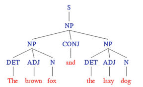
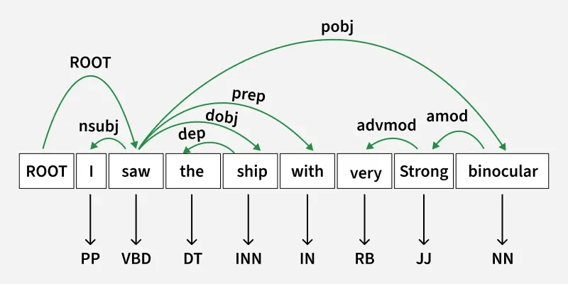

# Introduction to Syntax, Semantics & Morphology

##### Levels of Linguistic Analysis:
- Morphology: The study of the structure and formation of words, including prefixes, suffixes, and root words.
    - tokenization, stemming, lemmatization
- Syntax: The study of the arrangement of words and phrases to create well-formed sentences in a language.
    - POS (part-of-speech) tagging, parsing, dependency trees
- Semantics: The study of meaning in language, including the meanings of words, phrases, and sentences.
    - sentiment analysis, question answering

### Morphology
- Traditional NLP: Explicit rules for morphology, syntax, and semantics are defined by linguists and implemented in code.
- Modern NLP (BERT, GPT): Learn these patterns automatically from large datasets using machine learning and deep learning techniques.
---
Morphology: studies the internal structure of words, how words are built up from smaller meaningful units called morphemes.
- example: dogs = dog + s (where "s" indicates plural form), unladylike = un ("not") + lady ("well behaved women")+ like ("having the characteristic of")
- Morphemes can be classified into two types:
    - Free morphemes: can stand alone as words & often combine with other morphemes too (e.g., "book", "run").
    - Bound morphemes: cannot stand alone and must be attached to other morphemes (e.g., prefixes like "un-", suffixes like "-ed").

- Stems: the core part of a word to which affixes can be added (e.g., "play" in "playing", "played").

- Types of affixes:
    - Prefixes: added to the beginning of a word (e.g., "un-" in "unhappy").
    - Suffixes: added to the end of a word (e.g., "-ness" in "happiness").
    - Infixes: inserted within a word (less common in English, more common in other languages).

- Content and functional morphemes:
    - Content morphemes: carry semantic meaning (e.g., car, book, house, -able, un-)
    - Functional morphemes: serve grammatical purposes (e.g., A, the, he, -s (plural), -s (3rd singular)).

- Inflectional vs Derivational morphemes:
    - Inflectional morphemes: modify a word for grammar (tense, number, etc.) without changing its core meaning or part of speech (e.g., walk -> walked, cat -> cats).
    - Derivational morphemes: create new words by changing the meaning or part of speech (e.g., happy -> happiness, teach -> teacher, happy -> unhappy).

- Morphological Analysis:
    - cats -> cat +N + PL
    - cat -> cat +N + SG
    - cities -> city +N + PL
    - geese -> goose +N + PL
    - identifying root + affixes and their grammatical features
    - approaches:
        - Rule based: handcrafted rules to identify morphemes
        - Lexicon based: dictionary of morphemes and their features, handles irregular forms
        - Statistical: probabilistic models to predict morpheme boundaries based on training data. uses algorithms like HMM, CRF
        - Neural: deep learning models to learn morphological patterns from large datasets. character level or subword models. LSTMs, Transformers, learns morphological features implicitly.

### Syntax
- the structure of sentences and the rules that govern the formation of sentences in a language.
- how words combine to form sentences
- focuses on:
    - word order
    - phrase structure
    - grammatical relations
- same words -> different meaning with different syntax
    - "The cat chased the dog." vs "The dog chased the cat." (same words, different order, different meaning)

- resolve ambiguity using syntax
- helps machines identify grammatical structure of sentences....

- **syntax tree**: to formally represent syntactic structure, NLP uses heirarchical tree structures
    - nodes: syntactic categories (NP, VP, etc)
    - leaves: actual words (terminals)
    - branches: relationships between categories and words
    
    - constituents: a group of words acts as a single unit
    - syntax trees are built by grouping words into meaningful units called constituents.
    
- Modelling constituency
    - context free grammars (CFGs): most common way of modelling constituency
    - consists of production rules: these rules express the ways in which constituents can be combined to form larger constituents or sentences.
    ...

- CFG for languages
    - T: set of terminal symbols (words)
    - N: set of non-terminal symbols (syntactic categories) 
    - S: start symbol (usually represents a complete sentence)
    - R: set of production rules of the form X -> y, X ∈ N, y ∈ (N ∪ T)*

CFC defines a formal language = set of all sentences (string of words) that can be derived by the grammar.
- sentences in this set are called grammatical sentences
- sentences not in this set are called ungrammatical sentences

Parsing: the process of taking  string and a grammar and returning all the possisble parse trees for that string
- that is find all trees whose root is the start symbol S, which cover exactly the words in the string from left to right, and which obey all the production rules in the grammar.

Dependency Parsing:
- focuses on the relationships between words in a sentence rather than grouping them into constituents.

- parsing in NLP has moved from rule-based CFGs to neural network-based approaches that learn syntactic patterns from large annotated corpora.
- dependency parsing is preffered for practical applications due to its efficiency and ability to capture direct relationships between words.

### Semantics
Distributional Hypothesis: words that occur in similar contexts tend to have similar meanings.
- "You shall know a word by the company it keeps." - J.R. Firth
- "Words that occur in the same contexts tend to have similar meanings." - Zellig Harris
- a word's contextual representation is an abstract cognitive structutre that accumulates from encounters with the word in various linguistic contexts
- eg: "bank" in "river bank" vs "financial bank"

