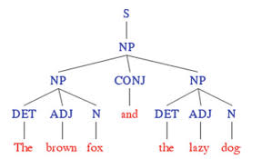
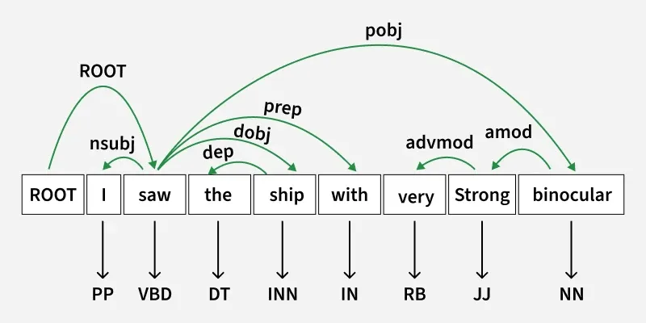

# Introduction to Syntax, Semantics & Morphology

## Levels of Linguistic Analysis:
- Morphology: The study of the structure and formation of words, including prefixes, suffixes, and root words.
    - tokenization, stemming, lemmatization
- Syntax: The study of the arrangement of words and phrases to create well-formed sentences in a language.
    - POS (part-of-speech) tagging, parsing, dependency trees
- Semantics: The study of meaning in language, including the meanings of words, phrases, and sentences.
    - sentiment analysis, question answering

### Morphology
- Traditional NLP: Explicit rules for morphology, syntax, and semantics are defined by linguists and implemented in code.
- Modern NLP (BERT, GPT): Learn these patterns automatically from large datasets using machine learning and deep learning techniques.
---
Morphology: studies the internal structure of words, how words are built up from smaller meaningful units called morphemes.
- example: dogs = dog + s (where "s" indicates plural form), unladylike = un ("not") + lady ("well behaved women")+ like ("having the characteristic of")
- Morphemes can be classified into two types:
    - Free morphemes: can stand alone as words & often combine with other morphemes too (e.g., "book", "run").
    - Bound morphemes: cannot stand alone and must be attached to other morphemes (e.g., prefixes like "un-", suffixes like "-ed").

- Stems: the core part of a word to which affixes can be added (e.g., "play" in "playing", "played").
- Affixes: bits and pieces that attach to stems to modify their meaning and grammatical function.
    - Types of affixes:
        - Prefixes: added to the beginning of a word (e.g., "un-" in "unhappy").
        - Suffixes: added to the end of a word (e.g., "-ness" in "happiness").
        - Infixes: inserted within a word (less common in English, more common in other languages).

- Content and functional morphemes:
    - Content morphemes: carry semantic meaning (e.g., car, book, house, -able, un-)
    - Functional morphemes: serve grammatical purposes (e.g., A, the, he, -s (plural), -s (3rd singular)).

- Inflectional vs Derivational morphemes:
    - Inflectional morphemes: modify a word for grammar (tense, case, number, etc.) without changing its core meaning or part of speech (e.g., walk -> walked, cat -> cats).
    - Derivational morphemes: create new words with different meaning or part of speech by adding affixes (e.g., happy -> happiness, teach -> teacher, happy -> unhappy).
    - inflection changes function of word within a sentence, derivation changes the word itself, potentially changing its part of speech or core sense.

- Morphological Analysis:
    - cats -> cat +N + PL
    - cat -> cat +N + SG
    - cities -> city +N + PL
    - geese -> goose +N + PL
    - identifying root + affixes and their grammatical features
    - approaches:
        - Rule based: handcrafted rules to identify morphemes
        - Lexicon based: dictionary of morphemes and their features, handles irregular forms
        - Statistical: probabilistic models to predict morpheme boundaries based on training data. uses algorithms like HMM, CRF
        - Neural: deep learning models to learn morphological patterns from large datasets. character level or subword models. LSTMs, Transformers, learns morphological features implicitly.

### Syntax
- the structure of sentences and the rules that govern the formation of sentences in a language.
- how words combine to form sentences
- focuses on:
    - word order
    - phrase structure
    - grammatical relations
- same words -> different meaning with different syntax
    - "The cat chased the dog." vs "The dog chased the cat." (same words, different order, different meaning)

- resolve ambiguity using syntax
- helps machines identify grammatical structure of sentences....

- **syntax tree**: to formally represent syntactic structure, NLP uses heirarchical tree structures
    - nodes: syntactic categories (NP, VP, etc)
    - leaves: actual words (terminals)
    - branches: relationships between categories and words
    
    - constituents: a group of words acts as a single unit
    - syntax trees are built by grouping words into meaningful units called constituents.
    
- Modelling constituency
    - context free grammars (CFGs): most common way of modelling constituency
    - consists of production rules: these rules express the ways in which constituents can be combined to form larger constituents or sentences.
    ...

- CFG for languages
    - T: set of terminal symbols (words)
    - N: set of non-terminal symbols (syntactic categories) 
    - S: start symbol (usually represents a complete sentence)
    - R: set of production rules of the form X -> y, X ∈ N, y ∈ (N ∪ T)*

CFC defines a formal language = set of all sentences (string of words) that can be derived by the grammar.
- sentences in this set are called grammatical sentences
- sentences not in this set are called ungrammatical sentences

Parsing: the process of taking  string and a grammar and returning all the possisble parse trees for that string
- that is find all trees whose root is the start symbol S, which cover exactly the words in the string from left to right, and which obey all the production rules in the grammar.

Dependency Parsing:
- focuses on the relationships between words in a sentence rather than grouping them into constituents.


- parsing in NLP has moved from rule-based CFGs to neural network-based approaches that learn syntactic patterns from large annotated corpora.
- dependency parsing is preffered for practical applications due to its efficiency and ability to capture direct relationships between words.

### Semantics
Distributional Hypothesis: words that occur in similar contexts tend to have similar meanings.
- "You shall know a word by the company it keeps." - J.R. Firth
- "Words that occur in the same contexts tend to have similar meanings." - Zellig Harris
- a word's contextual representation is an abstract cognitive structutre that accumulates from encounters with the word in various linguistic contexts
- eg: "bank" in "river bank" vs "financial bank"

Lexical Semantics:
- systematic meaning related connections among lexical items, and the internal meaning-related structure of indivdual lexical items.
- to identify the semantics of lexical items, we need to focus on the notion of lexeme, an individual entry in the lexicon
- lexeme should be thought of as a paring of a particular orhtographic and phonological form with some sort of ymbollic meaninf representation


Homonymy: relation that holds between words that have the same form but different meanings
- eg: "bat" (flying mammal) vs "bat" (sports equipment), bank (financial institution) vs bank (side of a river)
    - homographs: same spelling (orthographic form), different meanings (lead (to guide) vs lead (metal)) (bass (fish) vs bass (low freq sound))
    - homophones: same pronunciation, different spellings (write vs right), (pieace vs peace)
    - causes problems in text-to-speech, information retrieval, speech recognition

Polysemy: relation that holds between words that have the same form and related meanings
- multiple related meanings within a single lexeme
- eg: The bank (as a building) was constructed in 1875 out of local red brick. The bank (financial institution) offers various services.
 eg: Plums (tree) have beautiful blossoms. Plums (fruit) are delicious and nutritious.

 Synonymy: words that have the same meaning in ssome or all contexts 
- eg: big vs large, couch vs sofa
- cant replace everywhere due to connotations and collocations    
    - eg: big brother (authoritative figure) vs large brother (physically big)

Antonyms: words that have opposite meanings in same context
- eg: hot vs cold, big vs small, happy vs sad
- define a binary opposition to each other

Hyponymy: hierarchical relationship between more general and more specific terms
- eg: rose is a hyponym of flower, flower is a hypernym of rose

Hypernymy: hierarchical relationship between more general and more specific terms
- eg: flower is a hypernym of rose, rose is a hyponym of flower

Meronymy: part-whole relationship between words
- an asymetric, transitive relation where one term denotes a part of the other
- eg: wheel is a meronym of car, car is a holonym of wheel

Holonymy: whole-part relationship between words
- eg: car is a holonym of wheel, wheel is a meronym of car


WordNet: a large lexical database of English
- heirarchically organised lexical database

Synset: a set of synonyms that share a common meaning
- each synset represents a distinct concept or meaning
- eg: {car, auto, automobile, machine, motorcar} represents the concept of a motor vehicle

lemma vs synset:
- lemma: the canonical form of a word (dictionary form)
- synset: a set of synonyms that share a common meaning

Question:
Suppose you want to use a HMM tagger to tag the phrase "the beautiful lady", where we have the following probabilities:
- P(the | Det) = 0.3
- P(the | Noun) = 0.1
- P(beautiful | Noun) = 0.01
- P(beautiful | Adj) = 0.07
- P(beautiful | Verb) = 0.001
- P(lady | Noun) = 0.08
- P(lady | Verb) = 0.01
- P(Verb | Det) = 0.00001
- P(Noun | Det) = 0.5
- P(Adj | Det) = 0.04
- P(Noun | Noun) = 0.2
- P(Adj | Noun) = 0.002
- P(Noun | Adj) = 0.2
- P(Noun | Verb) = 0.3
- P(Verb | Noun) = 0.3
- P(Verb | Adj) = 0.001
- P(Verb | Verb) = 0.1

Work out i detail the steps of the Viterbi algorithm. Assume all other conditional probabiliites to be zero. Also, assume that all the tags have the same probabilities to appear in the beginning of a sentence.

|POS | Det | Noun | Adj | Verb |
|---|---|---|---|---|
|the | 0.3 | 0.1 | 0 | 0 |
|beautiful | 0 | 0.01 | 0.07 | 0.001 |
|lady | 0 | 0.08 | 0 | 0.01 |

|POS | Det | Noun | Adj | Verb |
|---|---|---|---|---|
|Det | 0 | 0.5 | 0.04 | 0.00001 |
|Noun | 0 | 0.2 | 0.002 | 0.3 |
|Adj | 0 | 0.2 | 0 | 0.001 |
|Verb | 0 | 0.3 | 0.001 | 0.1 |

```
          |----- Vs3(2)----|                         
Ns2(1)----|                |-----Vs2(3)
          |---- As2(2)-----|
Ds1(1)----|                |-----Bs1(3)
          |---- Ns1(2)-----|

the             beautiful          lady
1               2                   3
```

Level 1:
- S1(1) = 0.25 x P(the | D) = 0.25 x 0.3 = 0.075
- N1(1) = 0.25 x P(the | N) = 0.25 x 0.1 = 0.025

Level 2:
- S1(2) = max(
    - S1(1) x P (N | D) x P(beautiful | D) = 0.075 x 0.5 x 0.01 = 0.000375
    - S2(1) x P(N | N) x P(beautiful | N) = 0.025 x 0.2 x 0.01 = 0.00005
    - ) = 0.000375
- s2(2) = max(
    - S1(1) x P(Adj | D) x P(beautiful | Adj) = 0.075 x 0.04 x 0.07 = 0.00021
    - S2(1) x P(Adj | N) x P(beautiful | Adj) = 0.025 x 0.002 x 0.07 = 0.0000025
    - ) = 0.00021

- S1(3) = max(
    - S1(2) x P(N | N) x P(lady | N) = 0.000375 x 0.2 x 0.08 = 0.000006
    - S2(2) x P(N | Adj) x P(lady | N) = 0.00021 x 0.2 x 0.08 = 0.00000336
    - ) = 0.000006

- S2(3) = max(
    - S1(2) x P(Verb | N) x P(lady | Verb) = 0.000375 x 0.3 x 0.01 = 0.000001125
    - S2(2) x P(Verb | Adj) x P(lady | Verb) = 0.00021 x 0.001 x 0.01 = 0.0000000021
    - ) = 0.000001125

Level 3:
- S1(3) = max(s1(2) x P(N | N) x P(lady | N), s2(2) x P(N | Adj) x P(lady | N), S3(3) x P(N | Verb) x P(lady | N)) = max(0.000375 x 0.2 x 0.08, 0.00021 x 0.2 x 0.08) = 0.0000336

- S1(3)
    - P(lady | N) x P(N | N) = 0.08 x 0.2 = 0.016
    - P(lady | Adj) x P(Adj | N) = 0.01 x 0.002 = 0.00002
    - P(lady | Verb) x P(Verb | N) = 0.01 x 0.3 = 0.003
    - max of all three is 0.016, so S1(3) = 0.016

- S2(3)
    - P(lady | N) x P(N | Adj) = 0.08 x 0.2 = 0.016
    - P(lady | Adj) x P(Adj | Adj) = 0.01 x 0 = 0
    - P(lady | Verb) x P(Verb | Adj) = 0.01 x 0.001 = 0.00001
    - max of all three is 0.016, so S2(3) = 4.0e-6

Answer: 
- the: (D)
- beautiful: (Adj)
- lady: (N)

Suppose you want to use a HMM tagger to tag the phrase, “the lovely girl”, where we have the following probabilities:
P(the|Det) = 0.3, P(the|Noun) = 0.1, P(lovely|Noun) = 0.01, P(lovely|Adj) =0.07, P(lovely|Verb) = 0.001, P(girl|Noun) = 0.08, P(girl|Verb) = 0.01 ,P(Verb|Det) = 0.00001, P(Noun|Det) = 0.5,

 P(Adj|Det) = 0.4, P(Noun|Noun) =0.2, P(Adj|Noun) = 0.002, P(Noun|Adj) = 0.2, P(Noun|Verb) = 0.3, P(Verb|Noun) = 0.3, P(Verb|Adj) = 0.001, P(Verb|Verb) = 0.1
Work out in detail the steps of the Viterbi algorithm. Assume all other conditional probabilities, not mentioned to be zero. Also, assume that all tags have the same probabilities to appear in the beginning of a sentence.