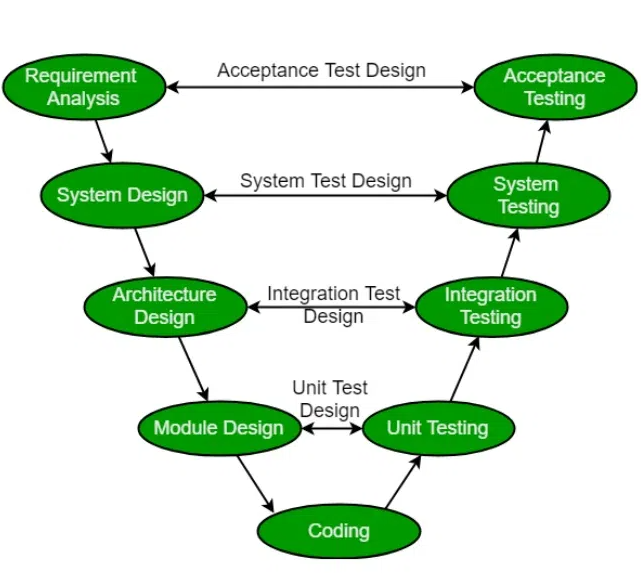
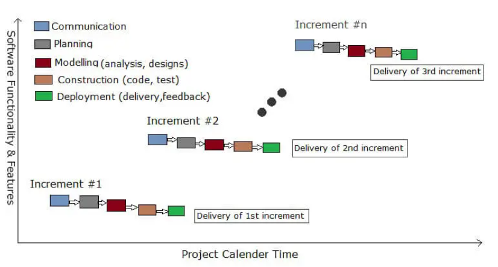
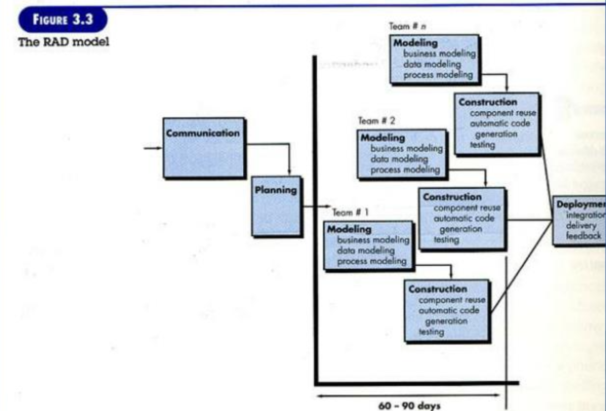

# The waterfall model
- linear, seuential project management approach
- development flows downwards through distinct phases
- each phase must be completed before the next begins
- very structured but rigid and less flexible to changes
- clear, unchaninging requirements

Steps:
1. Communication: project initiation and requirements gathering
2. PLanning (estimation, scheduling, staffing)
3. Modelling (analysis and design)
4. COntruction (implementation and testing)
5. Deployment (installation, activation, and delivery)

---

# V-process model
- another way of looking at the waterfall model
- corrections and verification are emphasized
- each development phase has a corresponding verification phase
- testinf starts early in the development process (once requirements are defined)
    
- Advantages:
  - each phase has specific deliverables and review processes
  - higher chances of success due to early detection of defects
  - time concern in comparision w the waterfall model is low 
  - works well for small to medium-sized projects with well-defined requirements
- Disadvantages:
    - very rigid like waterfall model
    - little room for flexibility and changes
    - software is not delivered until late in the process
    - model doesnt provide clear path for pronlems found during testing phase

# Incremental process model
- designed to produce the software in increments or small parts
- combines elements of waterfall and iterative models
- applies linear sequences in a staggered fashion as calendar time progresses 
- each linear sequences rpoduces deliverable "increments" to the software
- process flow for any increment may incorporare the prototype model
- customer uses the product; as a result a plan is developed for the next increment
- used when requirements are well understoof
- multiple independent deliverables can be developed and integrated
- work flow is linear within each increment and is staggered between increments
- provides a needed set of functionality sooner while 
- Advantages:
  - delivers functional software quickly
  - allows for user feedback and changes between increments
  - reduces initial delivery time and cost
  - easier to manage risks as issues can be identified early
    

# Rapid application development (RAD) model
- an incremental process model that emphasizes an extremely short development cycle
- "high speed" adaptation of the waterfall model
- if requirements are well understood and project scope is constrained
- enables to create a "fully functional system" in a short time frame
    
- Drawbacks:
    - requires highly skilled and dedicated developers and designers
    - improper modularization will be problematic
    - may lead to inadequate documentation
    - not suitable for large, complex systems

# Evolutionary process model
- produces an increasingly more complete version of the software with each iteration
- iterative
- protoyping is a key element
- customer may not identify detailed input, processing or output requirements
- developer may be unsure of the efficiency of an algorithm 
- adaptability of an os
- quick design

# Prototyping model
- follows an evolutionary and iterative approach
- used when requirements are not well understood
- serves as a mechanism for gathering requirements
- focuses on those aspects of the system that are visible to the user
- feedback from the user is used to refine the prototype

